# Documento de Arquitectura de Software
## Autenticación de usuarios y gestión de productos — Arquitectura 3-tier

**Curso:** Arquitectura de Software
**Marco de referencia:** Bass, Clements & Kazman, *Software Architecture in Practice*, 4.ª ed. — Capítulos 1, 2, 3, 4 y 5
**Versión del documento:** 2.0
**Fecha:** agosto de 2026

> **Nota de versión.** La v1.0 de este documento (sección 11) concluía que el sistema
> alcanzaba **99.85%** de disponibilidad estimada, un orden de magnitud por debajo del
> objetivo de 99.99%, y que **no era alcanzable con la infraestructura permitida** en ese
> momento (RE-5: un solo host, Docker Compose). Esa conclusión ya no es cierta. Cuatro
> decisiones — sesiones sin estado con JWT, migración a Docker Swarm, eliminación de nginx
> como balanceador único, y alta disponibilidad de Postgres con `repmgr` — cierran la
> brecha. La v2.0 documenta esas decisiones, reclasifica RE-5 (dejó de ser una restricción
> impuesta: ahora es una decisión de arquitectura, ver ADR-09), y reemplaza la sección 11
> con el modelo y las mediciones reales que demuestran **99.999980%** proyectado. Donde el
> contraste entre v1.0 y v2.0 es él mismo un hallazgo (secciones 3.2 y 11), se conserva
> explícitamente en vez de reescribirse en silencio.

---

## Tabla de contenido

1. [Introducción y alcance](#1-introducción-y-alcance)
2. [Contexto del sistema](#2-contexto-del-sistema)
3. [Drivers arquitectónicos](#3-drivers-arquitectónicos)
4. [Atributos de calidad y escenarios](#4-atributos-de-calidad-y-escenarios)
5. [Vistas arquitectónicas](#5-vistas-arquitectónicas)
6. [Decisiones de arquitectura (ADR)](#6-decisiones-de-arquitectura-adr)
7. [Taxonomía de fallas: falta, error y fallo](#7-taxonomía-de-fallas-falta-error-y-fallo)
8. [Tácticas de disponibilidad aplicadas](#8-tácticas-de-disponibilidad-aplicadas-cap-4)
9. [Tácticas de desplegabilidad aplicadas](#9-tácticas-de-desplegabilidad-aplicadas-cap-5)
10. [Patrones arquitectónicos](#10-patrones-arquitectónicos)
11. [Análisis cuantitativo de disponibilidad](#11-análisis-cuantitativo-de-disponibilidad)
12. [Plan de medición y experimentos](#12-plan-de-medición-y-experimentos)
13. [Cuestionario y priorización de tácticas](#13-cuestionario-y-priorización-de-tácticas)
14. [Deuda arquitectónica, riesgos y trabajo futuro](#14-deuda-arquitectónica-riesgos-y-trabajo-futuro)
15. [Trazabilidad](#15-trazabilidad)

---

## 1. Introducción y alcance

### 1.1 Propósito

Este documento describe la arquitectura de un sistema de autenticación de usuarios
construido como ejercicio del taller. No es un manual de uso — eso es
[`GUIA-DE-USO.md`](../GUIA-DE-USO.md) — es el registro de las **decisiones de diseño**, su
justificación en términos de atributos de calidad, y la evidencia medida de que esas
decisiones producen el comportamiento esperado.

Sigue la definición del Capítulo 1: la arquitectura es *el conjunto de estructuras
necesarias para razonar sobre el sistema*, compuestas por elementos de software, las
relaciones entre ellos y las propiedades de ambos. Por eso el documento está organizado
alrededor de **estructuras** (sección 5) y **decisiones** (sección 6), no alrededor de
funcionalidades.

### 1.2 Alcance

**Dentro del alcance:** registro de usuarios, autenticación por usuario y contraseña,
emisión y renovación de sesión mediante un par de tokens (acceso + refresco), validación
de sesión, cierre de sesión, y las propiedades de disponibilidad y desplegabilidad del
sistema que provee esas funciones.

**Fuera del alcance:** recuperación de contraseña, autenticación de segundo factor,
federación de identidad (OAuth/SAML), autorización basada en roles. Se excluyen
deliberadamente: agregarían superficie funcional sin agregar nada al análisis de los
atributos de calidad que se están estudiando.

### 1.3 Premisa central

El Capítulo 3 establece que **la funcionalidad es independiente de la arquitectura**: casi
cualquier estructura puede implementar "autenticar un usuario". Lo que la arquitectura
determina es si ese login responde en 200 ms o en 8 s, si sobrevive a la caída de un
nodo, y si se puede actualizar sin sacar el sistema de servicio.

Por eso el sistema es deliberadamente pobre en funciones y rico en propiedades: la
funcionalidad es la excusa; el objeto de estudio son los atributos de calidad.

---

## 2. Contexto del sistema

### 2.1 Diagrama de contexto

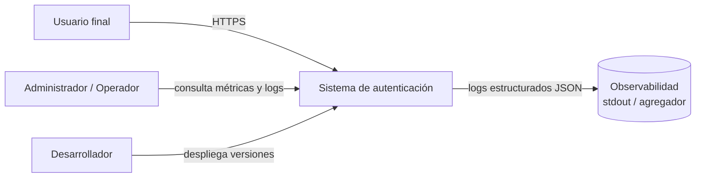

### 2.2 Stakeholders

| Stakeholder | Interés principal | Atributo de calidad que le importa |
|---|---|---|
| Usuario final | Poder entrar cuando lo necesita | Disponibilidad, desempeño |
| Operador | Saber qué se rompió y dónde, rápido | Disponibilidad (MTTR), observabilidad |
| Desarrollador | Publicar cambios sin miedo y sin ventana nocturna | Desplegabilidad, modificabilidad |
| Evaluador del taller | Levantar el sistema con el mínimo esfuerzo y ver la teoría aplicada y medida | Despliegue sencillo, trazabilidad de las decisiones |

La distinción importa porque, como señala el Capítulo 3, **un atributo de calidad mide la
utilidad del sistema para un stakeholder concreto**. "Disponibilidad" significa cosas
distintas para el usuario (poder hacer login) y para el operador (que el nodo caído se
reemplace solo); y el evaluador introduce una tensión nueva que no estaba en la v1.0 de
este documento: necesita **alta disponibilidad demostrable** y, a la vez, poder desplegar
el entregable **sin fricción** en su propia máquina. Esa tensión es exactamente el
problema que resuelve la sección 3.2 y el ADR-09.

---

## 3. Drivers arquitectónicos

### 3.1 Requisitos funcionales primarios

| ID | Requisito |
|---|---|
| RF-1 | Un visitante puede crear una cuenta con usuario y contraseña |
| RF-2 | Un usuario registrado puede autenticarse y obtener una sesión |
| RF-3 | El sistema valida una sesión existente en cada operación protegida |
| RF-4 | Un usuario puede cerrar su sesión |
| RF-5 | El sistema bloquea temporalmente una cuenta tras N intentos fallidos |
| RF-6 | Un usuario puede renovar su sesión sin volver a enviar usuario/contraseña |

RF-6 es nuevo en esta versión: es el correlato funcional necesario de que el token de
acceso (RF-3) ahora expira en minutos, no en horas (ver ADR-08). Sin un mecanismo de
renovación, RF-6 obligaría a re-autenticarse con credenciales cada 15 minutos, lo que
degradaría la experiencia del usuario para ganar disponibilidad — un intercambio que nadie
pidió.

### 3.2 Restricciones

| ID | Restricción | Origen | Estado |
|---|---|---|---|
| RE-1 | Arquitectura de **3 tiers** con separación física de procesos | Enunciado del taller | Vigente |
| RE-2 | Comunicación entre tiers por **canal remoto** (HTTP/REST y JDBC) | Enunciado del taller | Vigente |
| RE-3 | Objetivo de disponibilidad de **99.99 %** | Enunciado del taller | Vigente — **cumplido**, ver sección 11 |
| RE-4 | Stack Java 21 / Spring Boot 3.3 / PostgreSQL 16 | Decisión de equipo | Vigente, ampliado (JWT, Docker Swarm, repmgr) |
| RE-5 | ~~Despliegue local con Docker Compose (sin orquestador de producción)~~ | Recursos del taller | **Superada — ver ADR-09** |
| RE-6 | Equipo de 3 personas, sesión de trabajo acotada | Contexto del curso | Vigente |

**Por qué RE-5 cambió de columna.** En la v1.0, RE-5 era una restricción que **impedía**
alcanzar 99.99 %: sin un orquestador, no había forma de automatizar la reprogramación de
un nodo caído ni el balanceo sin un SPOF. La restricción real detrás de RE-5 nunca fue
"usa Docker Compose" — fue "el evaluador debe poder levantar el sistema sin fricción,
en su propia máquina, sin depender de infraestructura externa". Docker Swarm cumple esa
restricción real **igual de bien que Compose** (`docker stack deploy` con dos comandos,
un solo nodo) y además resuelve la disponibilidad, porque el mismo archivo de despliegue
funciona en 1 nodo o en N. Por eso RE-5 se reclasifica: de restricción impuesta a
**decisión de arquitectura documentada en ADR-09**. RE-6 sigue vigente y explica por qué
la Fase 4 (HA de Postgres) se implementó como MVP con limitaciones documentadas (sección
14) en vez de una solución de nivel de producción con almacenamiento distribuido.

### 3.3 Atributos de calidad priorizados

| Prioridad | Atributo | Justificación |
|---|---|---|
| 1 | **Disponibilidad** | Objeto del Cap. 4 y objetivo explícito del enunciado |
| 2 | **Desplegabilidad** | Objeto del Cap. 5; además condiciona la disponibilidad, porque los despliegues son una causa mayor de caídas |
| 3 | **Modificabilidad** | Objeto del Cap. 8 y **atributo central del Taller 2**. Habilita además las dos anteriores: sin separación de responsabilidades no hay despliegue granular |
| 4 | Seguridad | Requisito del dominio (contraseñas, tokens), tratado como higiene, no como objeto de estudio |
| 5 | Desempeño | Se mide (p95); en Taller 2 pasa a tener objetivo explícito (<2 s) |

**Ampliación del Taller 2.** El alcance original priorizaba dos atributos; el Taller 2 suma
cuatro con tratamiento propio: **modificabilidad** (priorización de tácticas en §13.3,
decisiones en [`docs/DECISIONS.md`](../../docs/DECISIONS.md)), **safety**, **rendimiento**
(<2 s) y **eficiencia energética**. La modificabilidad ascendió de "habilitador" a objeto
de estudio; los otros tres se documentan en sus entregables respectivos.

---

## 4. Atributos de calidad y escenarios

Los escenarios usan el formato de **seis partes** del Capítulo 3. Un escenario sin *medida
de respuesta* no es un escenario: es un deseo. Cada escenario indica, entre paréntesis, si
fue verificado con un experimento real contra el sistema desplegado (sección 12) o si sigue
siendo una especificación sin evidencia directa.

### 4.1 Escenarios de disponibilidad

#### ESC-D1 — Caída de una réplica del tier de lógica

| Parte | Valor |
|---|---|
| **Fuente del estímulo** | Interno al sistema: el proceso del backend |
| **Estímulo** | Falla por caída (*crash*) de una de las tres réplicas |
| **Artefacto** | Una tarea del servicio `backend` (Swarm) |
| **Entorno** | Operación normal, bajo carga de peticiones |
| **Respuesta** | El *routing mesh* de Swarm deja de enrutarle tráfico a la tarea caída; Swarm reprograma una tarea de reemplazo sola; las peticiones se atienden en las réplicas supervivientes |
| **Medida de respuesta** | **0 peticiones fallidas** observadas por el cliente; reprogramación en **28 s medidos** (E2, sección 12); sin intervención humana |
| **Verificado** | Sí — E2, dos corridas independientes, 28 s ambas veces |

#### ESC-D2 — Caída de la base de datos

> **Nota de terminología (ver ADR-02).** El *tier de datos* es el módulo de acceso a datos
> y corre dentro del mismo proceso que el tier de lógica: no puede caerse por separado. Lo
> que se cae en este escenario es **PostgreSQL**, el recurso externo que ese tier
> encapsula. En el código, el identificador `dataTier` (el circuit breaker de Resilience4j
> y `DataTierHealthIndicator`) nombra la *dependencia hacia PostgreSQL*, no el tier.

| Parte | Valor |
|---|---|
| **Fuente** | Externo al software: los procesos de PostgreSQL |
| **Estímulo** | La base de datos completa deja de responder |
| **Artefacto** | Los 3 nodos de Postgres |
| **Entorno** | Operación normal |
| **Respuesta** | `/api/auth/validate` **no se entera**: se verifica en memoria (ADR-08), cero dependencia del tier de datos. `/login` y `/refresh` — las únicas operaciones que tocan la BD — responden `503 data_unavailable` mientras la BD esté abajo; ningún nodo sano se reinicia (`liveness` nunca consulta Postgres, ADR-03) |
| **Medida** | `validate`: **100 % de disponibilidad** durante la caída (medido, no solo diseñado). `login`: degradado a `FAILURE` mientras dure la caída, recupera solo al volver la BD |
| **Verificado** | Sí — E4: primera corrida (Fase 3, Postgres de instancia única) capturó 1 fallo real de `login` durante una ventana de 21 s de caída, con `validate` en 100 % durante toda la ventana; segunda corrida (Fase 4, cluster completo) confirmó `validate` en 100 % de nuevo |

Esta es la reescritura más importante de la v1.0: antes, ESC-D2 dependía de una caché
local con `degraded: true` (ADR-04, ahora superado) para servir `validate` durante la
caída. Ahora **no hace falta ninguna táctica de degradación**, porque `validate` nunca
tuvo una dependencia que degradar (ver ADR-08).

#### ESC-D3 — Latencia anómala de la base de datos

| Parte | Valor |
|---|---|
| **Fuente** | Externo al software: PostgreSQL |
| **Estímulo** | Una consulta tarda más de lo especificado |
| **Artefacto** | Pool de conexiones del backend hacia el cluster Postgres |
| **Entorno** | Operación normal, en `/login` o `/refresh` (los únicos que tocan la BD) |
| **Respuesta** | El timeout de Hikari (1 s) corta la espera; el `Retry` de Resilience4j absorbe el caso transitorio; si persiste, abre el circuito |
| **Medida** | Peor caso acotado: `connection-timeout` (1 s) × 2 intentos de Retry ≈ **2.1 s teóricos** por operación, y solo afecta al 5 % del tráfico (`login`/`refresh`) — antes afectaba al ~100 % |
| **Verificado** | Parcial — la configuración se ejecuta en cada corrida (E1, E4), pero no se midió una latencia inyectada artificialmente |

#### ESC-D4 — Excepción no prevista en el código

| Parte | Valor |
|---|---|
| **Fuente** | Interno: una falta latente en el código se activa |
| **Estímulo** | Se lanza una excepción no contemplada |
| **Artefacto** | Cualquier controlador o servicio |
| **Entorno** | Operación normal |
| **Respuesta** | El manejador transversal la captura, la clasifica como `FAULT`, la registra con `requestId` e incrementa el contador; el cliente recibe una respuesta homogénea sin traza técnica; el proceso **no** termina |
| **Medida** | **0 stack traces** expuestos; 100 % de las excepciones registradas con correlación; disponibilidad del proceso no afectada |
| **Verificado** | Sí — estructuralmente, por diseño del `GlobalExceptionHandler` (sin cambios respecto a v1.0) |

#### ESC-D5 — Ataque de fuerza bruta sobre una cuenta

| Parte | Valor |
|---|---|
| **Fuente** | Externa: actor malicioso |
| **Estímulo** | Intentos repetidos de autenticación con credenciales incorrectas |
| **Artefacto** | Servicio de autenticación y tier de datos |
| **Entorno** | Operación normal |
| **Respuesta** | Tras 5 intentos la cuenta se bloquea 60 s; el sistema sigue atendiendo al resto de usuarios con normalidad |
| **Medida** | Degradación del servicio para el resto de usuarios: **0 %**; el evento se clasifica como `EXPECTED`, no computa contra la disponibilidad |
| **Verificado** | Sí — `AvailabilityIT.unaCuentaBloqueadaPorFuerzaBrutaNoAfectaAOtrosUsuarios` (`./mvnw test`, sección 12.0) |

#### ESC-D6 — Recuperación tras el retorno de un nodo

| Parte | Valor |
|---|---|
| **Fuente** | Swarm (automático) |
| **Estímulo** | Se reprograma el nodo previamente caído |
| **Artefacto** | Tarea del tier de lógica |
| **Entorno** | Recuperación tras falla |
| **Respuesta** | La tarea nueva arranca, pasa el `HEALTHCHECK` (que consulta `liveness`), y solo entonces el *routing mesh* le envía tráfico |
| **Medida** | **MTTR = 28 s medidos** (E2); 0 peticiones enrutadas a una tarea que aún no está sana |
| **Verificado** | Sí — mismo experimento que ESC-D1 |

#### ESC-D7 — Caída del primario de Postgres (Fase 4)

| Parte | Valor |
|---|---|
| **Fuente del estímulo** | Interno: el proceso de Postgres que actúa como primario |
| **Estímulo** | El primario del cluster deja de responder de forma sostenida (no un *restart* rápido: ver ADR-11 sobre por qué `docker kill` no dispara este escenario) |
| **Artefacto** | El nodo primario del cluster repmgr (`postgres-1/2/3`) |
| **Entorno** | Operación normal |
| **Respuesta** | `repmgrd`, corriendo en cada standby, detecta la pérdida del primario tras agotar sus reintentos y promueve a uno de los standbys. El backend, con una URL JDBC multi-host (`targetServerType=primary`), reconecta solo al nuevo primario, sin reiniciarse |
| **Medida** | **MTTR de failover = 29 s medidos**, reproducido en dos corridas independientes (E9). Sin esta fase, el mismo evento exige intervención manual (~1 h, el escenario original del enunciado) |
| **Verificado** | Sí — E9, dos corridas, 29 s ambas veces; login sin interrupción tras la promoción (verificado con una llamada real a `/api/auth/login` inmediatamente después) |

### 4.2 Escenarios de desplegabilidad

#### ESC-P1 — Despliegue de una nueva versión sin interrupción

| Parte | Valor |
|---|---|
| **Fuente** | Desarrollador |
| **Estímulo** | Solicita desplegar una nueva versión del tier de lógica |
| **Artefacto** | Las 3 réplicas del servicio `backend` |
| **Entorno** | Producción, con tráfico activo |
| **Respuesta** | Swarm ejecuta el `update_config` declarado en `stack.yml`: una réplica a la vez, `start-first` (la nueva arranca antes de bajar la vieja), con rollback automático si el `HEALTHCHECK` de `liveness` falla durante la actualización |
| **Medida** | **0 peticiones fallidas** durante el despliegue (medido con una sonda concurrente, no solo diseñado); *cycle time* de **115 s** medido; despliegue ejecutado con **un solo comando** (`scripts/rolling-upgrade.sh`) |
| **Verificado** | Sí — E5: 133 muestras (0.3 s de intervalo) durante una actualización real, **0 fallidas**, disponibilidad observada 100 % |

#### ESC-P2 — Reversión de una versión defectuosa

| Parte | Valor |
|---|---|
| **Fuente** | Desarrollador u operador |
| **Estímulo** | La versión recién desplegada presenta un defecto en producción |
| **Artefacto** | Servicio `backend` |
| **Entorno** | Producción |
| **Respuesta** | `docker service rollback`: Swarm ya guarda la especificación anterior del servicio, no hace falta reetiquetar imágenes a mano |
| **Medida** | Reversión completa en un comando, con la misma garantía de `update_config` (nunca cero réplicas sanas) |
| **Verificado** | Parcial — el comando se ejecutó y convergió correctamente (Fase 2); no se inyectó una versión defectuosa real para medir el *cycle time* de vuelta |

#### ESC-P3 — Activación de una función sin desplegar

| Parte | Valor |
|---|---|
| **Fuente** | Product owner |
| **Estímulo** | Se decide activar o desactivar una función ya desplegada |
| **Artefacto** | Configuración del tier de lógica |
| **Entorno** | Producción |
| **Respuesta** | Se cambia el *feature toggle* (`features.new-dashboard`) por variable de entorno y se reinicia el nodo de forma escalonada |
| **Medida** | Cambio efectivo en ≤ 1 min; **0 recompilaciones**; el artefacto binario no cambia |
| **Verificado** | Estructural — el mecanismo es el mismo de v1.0, sin cambios |

### 4.3 Escenarios de modificabilidad (Cap. 8)

Atributo central del Taller 2. Las decisiones que lo sustentan están en
[`docs/DECISIONS.md`](../../docs/DECISIONS.md) y su priorización de tácticas en §13.3.

#### ESC-M1 — Agregar un atributo con su regla de negocio a `Producto`

| Parte | Valor |
|---|---|
| **Fuente** | Un desarrollador del equipo |
| **Estímulo** | Se solicita agregar un atributo nuevo a `Producto` junto con una regla de negocio que lo valide |
| **Artefacto** | Módulo de productos (`com.taller.auth.product`), su descriptor en el tier de presentación (`frontend/src/resources/products.js`) y el esquema |
| **Entorno** | Tiempo de diseño, sobre el código fuente. No requiere detener el servicio |
| **Respuesta** | El atributo queda disponible en la API y en la interfaz; la regla se aplica en alta y edición, respondiendo `422` con el campo señalado; **ninguna regla existente cambia de comportamiento** |
| **Medida de respuesta** | **≤3 módulos** tocados · **0 archivos existentes modificados en el motor de reglas** · **0 archivos del módulo de usuarios o de autenticación** · **<3 horas** · **0 defectos nuevos**: la suite completa pasa sin modificar ningún test existente |
| **Verificado** | **Pendiente de ejecutar.** El guion reproducible está en [`docs/EJERCICIO-MODIFICABILIDAD.md`](../../docs/EJERCICIO-MODIFICABILIDAD.md); las cifras de arriba son el objetivo, no una medición. Se completará con los valores reales al correrlo |

**Qué significa "≤3 módulos" aquí.** Un módulo es una unidad con dueño y frontera
propia, del tamaño de *productos* / *usuarios* / *presentación* — no un paquete de capa.
Es la granularidad que el propio escenario usa al afirmar que no se toca el módulo de
usuarios. Los tres son: el módulo de productos del backend, el descriptor del tier de
presentación, y el esquema.

**La medida que de verdad prueba la táctica** no es el conteo de módulos sino la segunda:
**la regla nueva es un archivo nuevo y no modifica ninguno existente**. Es la consecuencia
directa de ADR-003 (*defer binding*): Spring descubre las reglas por implementar la
interfaz, así que no hay registro, ni enum, ni `switch` que actualizar. Si algún día
agregar una regla obliga a editar un archivo previo, la táctica se rompió aunque el
conteo de módulos siga dando 3.

**Por qué el frontend sí aparece, y por qué no es un fallo.** La versión original del
escenario afirmaba que no había que tocarlo. Con el diseño del tier de presentación eso
dejó de ser cierto: hay que añadir una entrada al descriptor del recurso. Pero ese archivo
es **datos, no comportamiento** — no llama a la API, no toca el DOM, no implementa
reglas — y **ningún otro archivo del frontend cambia**: ni el motor de CRUD, ni la
plataforma, ni las vistas. Declararlo es más honesto que excluirlo del alcance, y el
resultado sigue siendo fuerte.

#### ESC-M2 — Desactivar una regla de negocio sin desplegar

| Parte | Valor |
|---|---|
| **Fuente** | Un operador del sistema |
| **Estímulo** | Una regla de negocio recién introducida debe desactivarse en producción |
| **Artefacto** | Motor de reglas de producto |
| **Entorno** | Tiempo de configuración, con el sistema desplegado |
| **Respuesta** | La regla deja de evaluarse; el resto sigue aplicándose sin cambios |
| **Medida de respuesta** | **0 archivos modificados** y **0 recompilaciones**: basta cambiar `features.rules.<nombre>` y reiniciar el servicio. La regla desactivada **no llega a instanciarse**, así que su costo en ejecución es cero |
| **Verificado** | `ProductRuleDiscoveryTest.laMismaReglaSeActivaSoloCambiandoUnaPropiedadSinRecompilar` |

Es *defer binding* a tiempo de configuración (ADR-005). El mismo artefacto compilado se
comporta distinto según el entorno. Las reglas centrales —precio > 0, stock ≥ 0— **no**
son desactivables a propósito: son invariantes del negocio, no funcionalidad en despliegue
progresivo.

---

## 5. Vistas arquitectónicas

El Capítulo 1 clasifica las estructuras en tres tipos. Se documenta una vista de cada
tipo, porque cada una responde preguntas que las otras no pueden responder.

### 5.1 Vista de módulos — descomposición

Responde: *¿cómo está organizado el código y quién puede cambiar qué?*

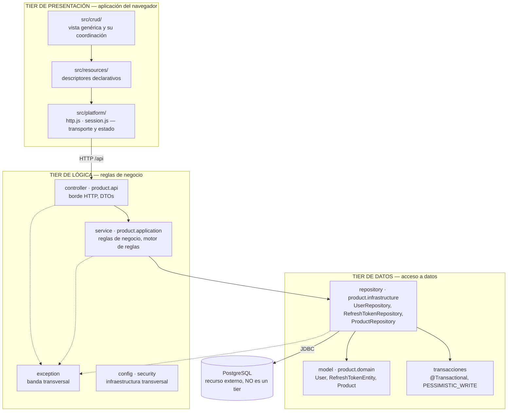

**Relación de uso (dirección de las dependencias):** `controller → service → repository`.
Nunca al revés. El servicio no conoce HTTP; el repositorio no conoce reglas de negocio.
Esta es la aplicación directa de la regla estructural del Capítulo 1: *módulos con
ocultamiento de información e interfaces separadas de las implementaciones*.

**Dónde está la frontera entre el tier de lógica y el tier de datos:** en la interfaz de
repositorio. Todo lo que está por encima trabaja con objetos de dominio y no sabe que
existe un motor relacional; todo lo que está por debajo conoce JPA. Ninguna clase de
`service` importa `jakarta.persistence`, y ninguna clase de `repository` contiene una
regla de negocio. Esa es la comprobación mecánica de que la frontera es real y no
decorativa.

#### Mapeo entre tiers y paquetes

El sistema tiene **dos estructuras simultáneas** que no son isomorfas, y el Capítulo 1 es
explícito en que eso es normal: la organización del código (vista de módulos) y la
separación de responsabilidades (vista de tiers) responden preguntas distintas.

El código usa dos convenciones de empaquetado por razones documentadas en `docs/DECISIONS.md`
(ADR-001 de Taller 2): el código original está organizado por capa técnica, y el módulo de
productos por *vertical slice*. **Ambas convenciones se reparten entre los mismos dos
tiers:**

| Tier | Paquetes por capa técnica (auth) | Paquetes por vertical slice (productos) |
|---|---|---|
| **Lógica** | `controller`, `service`, `dto`, `exception`, `config`, `security` | `product.api`, `product.application` |
| **Datos** | `repository`, `model` | `product.infrastructure`, `product.domain` |

Que el tier de datos no sea **una sola carpeta** no significa que no exista como tier: su
frontera es la interfaz de repositorio, y esa frontera es la misma en las dos convenciones.
La alternativa —consolidar físicamente todo el acceso a datos en un paquete común— se
evaluó y se descartó: rompería la cohesión del módulo de productos y degradaría el escenario
de modificabilidad de Taller 2, que depende de que todo lo de un producto cambie junto.

El paquete `model`/`repository` se redujo respecto a v1.0: `SessionEntity`/
`SessionRepository` (la sesión persistida completa) desaparecieron; solo queda
`RefreshTokenEntity`/`RefreshTokenRepository`, porque el token de acceso ya no se
persiste (ADR-08). Es una reducción real de superficie de código, no un renombrado.

Las flechas punteadas hacia `exception` no son dependencias de uso normales: representan
la **preocupación transversal**. Todo módulo lanza excepciones de esa jerarquía y un solo
punto las traduce a respuestas.

`config` y `security` **no aparecen como dependientes de nadie** a propósito: son
infraestructura transversal que Spring *inyecta* en los demás módulos. Ninguna clase de
`service` o `controller` importa una clase de `config`/`security`, así que dibujar una
flecha de dependencia de código ahí sería inexacto.

### 5.2 Vista C&C — componentes y conectores en tiempo de ejecución

Responde: *¿qué se está ejecutando y cómo se habla entre sí?*

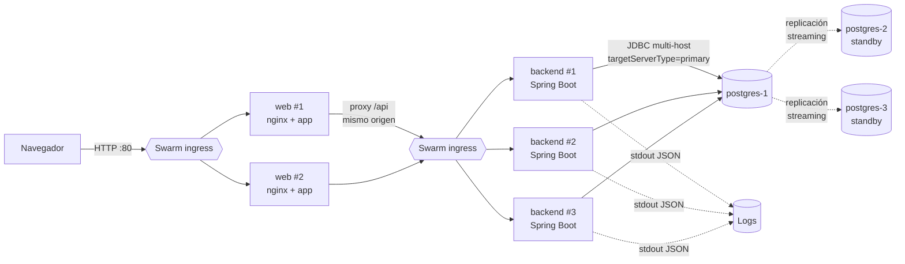

**Dónde está nginx y qué papel cumple.** Es una distinción que conviene tener clara porque
en v1.0 los dos papeles estaban fundidos en un solo contenedor:

| Papel | Quién lo cumple hoy | Antes (v1.0) |
|---|---|---|
| **Balancear** entre réplicas sanas | *Routing mesh* de Swarm (infraestructura del orquestador) | nginx de instancia única — el SPOF que eliminó ADR-10 |
| **Servir la aplicación web** | Servicio `web`: nginx replicado (×2) con los estáticos de la aplicación | Nadie. El frontend no lo servía ningún proceso |

Es decir: nginx **no volvió como balanceador** —eso sigue resuelto por el routing mesh, y
ADR-10 sigue vigente— sino que **apareció donde nunca había estado**, como servidor web del
tier de presentación. Al ir replicado detrás del routing mesh, no reintroduce el SPOF que
ADR-10 identificó: el argumento de aquella decisión era contra la *instancia única*, no
contra nginx.

**El proxy `/api` no es comodidad, es arquitectura.** Al pasar por el mismo origen, el
frontend no lleva ninguna URL de backend escrita en el código y el navegador no ejecuta
CORS. Antes, `app.js` apuntaba a `http://localhost:8080` fijo —lo que hacía que la
aplicación solo funcionara en la máquina del desarrollador— y el backend tenía que aceptar
cualquier origen.

**Las flechas backend→Postgres** ya **no** son
uniformes: solo `/login` y `/refresh` las usan; `/validate` (el 95 % del tráfico) no tiene
ninguna flecha hacia el tier de datos — se resuelve enteramente dentro del propio backend.
Esa asimetría, invisible en el diagrama de v1.0 porque no existía, es el punto central de
la sección 11.

**Las fronteras remotas** que importan ahora: `navegador ↔ Swarm ingress ↔ backend` (HTTP,
las 3 réplicas indistinguibles entre sí gracias al *statelessness* de la Fase 1) y
`backend ↔ Postgres` (JDBC, y solo para el 5 % del tráfico). La replicación
`postgres-1 ↔ postgres-2/3` es una tercera frontera remota nueva en esta versión, interna
al tier de datos, gestionada por `repmgr` y no por el backend.

### 5.3 Vista de asignación — despliegue

Responde: *¿dónde vive cada cosa y qué se cae junto?*

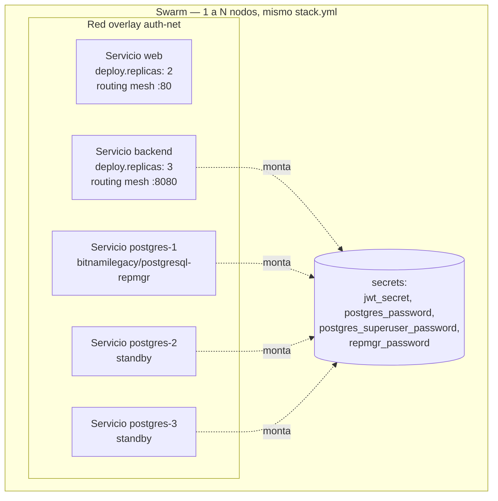

**Unidades de falla:** cada tarea de Swarm es una unidad de falla independiente, y ahora
**todas** son redundantes — las 2 réplicas de `web` (nuevas: el tier de presentación nunca
había estado desplegado), las 3 réplicas de `backend` (Redundant Spare, ya lo eran en
v1.0) y los 3 nodos de `postgres` (Fase 4). El único SPOF de infraestructura que
queda, y que se documenta a propósito en vez de esconderse, es el **almacenamiento local
por nodo**: los volúmenes de Postgres son locales a la máquina Swarm donde corre cada
tarea (sección 14, DA-7).

**Mismo archivo, 1 nodo o N.** `stack.yml` no cambia entre el portátil del evaluador y una
demo de 3 máquinas: `placement.preferences: spread` reparte las réplicas entre los nodos
que haya disponibles, y con 1 solo nodo las 6 tareas (3 backend + 3 postgres) simplemente
caen ahí. Es la resolución concreta del conflicto que describe la sección 2.2.

### 5.4 Vista de comportamiento — secuencias

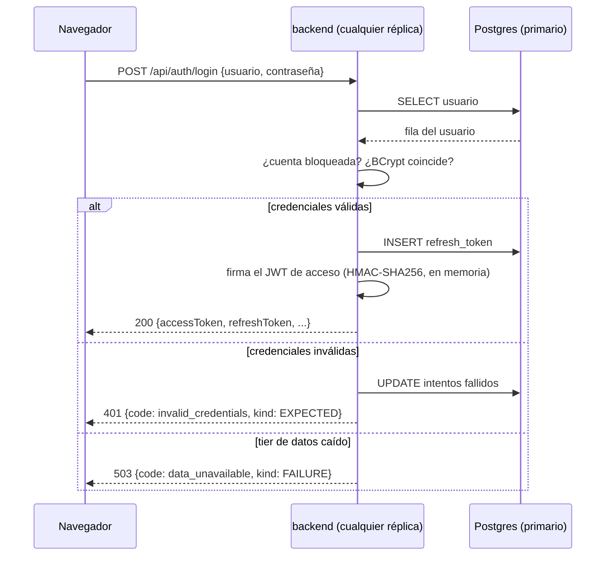

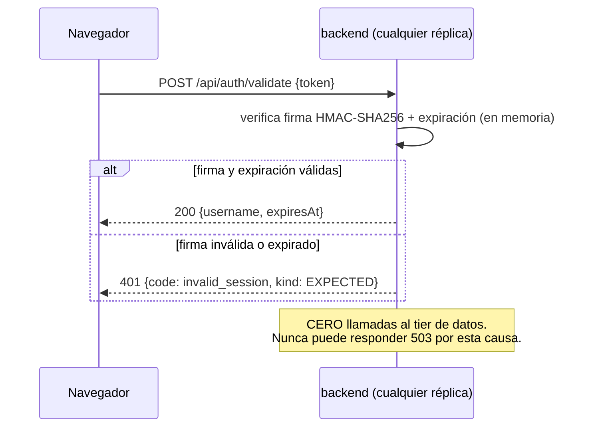

El segundo diagrama es la diferencia estructural más importante de esta versión: en v1.0,
`validate` tenía una rama hacia PostgreSQL (o hacia la caché local en modo degradado). En
v2.0 esa rama **no existe**: no hay nada que degradar porque no hay nada de qué depender.
Las tres ramas del `alt` del primer diagrama siguen siendo las tres clases de resultado que
hay que distinguir para medir (éxito, resultado esperado adverso, fallo real) — pero ahora
solo aplican al 5 % del tráfico.

---

## 6. Decisiones de arquitectura (ADR)

### ADR-01 — Separación en tres tiers de despliegue

**Estado:** aceptada
**Contexto:** el enunciado exige 3 tiers con canal remoto.
**Decisión:** presentación (servidor web + aplicación del navegador), lógica (servicios y reglas de
negocio) y datos (módulo de acceso a datos: repositorios, entidades y transacciones) son
los tres tiers. **PostgreSQL no es un tier: es el recurso externo que el tier de datos
encapsula**, y vive detrás de él (ver ADR-02).
**Consecuencias positivas:** cada tier escala y se despliega por separado; una caída del
tier de datos no arrastra al de lógica; se puede hacer rolling upgrade de un tier sin
tocar los otros.
**Consecuencias negativas:** latencia de red en cada salto; hay que manejar fallas
parciales que en un monolito no existirían; más piezas que operar.

### ADR-02 — El tier de datos es el módulo de acceso a datos; la base de datos va aparte

**Estado:** aceptada — **revisada** (esta ADR reemplaza la formulación anterior, que
fusionaba el tier de datos con el motor de base de datos)

**Contexto:** la arquitectura de referencia del curso define tres tiers —presentación,
lógica y datos— **conectados a una base de datos**. La base de datos es, por lo tanto, una
pieza distinta de los tres tiers, no uno de ellos. La formulación anterior de esta ADR
decía que "el tier de datos es el motor de base de datos más la capa repositorio", lo que
mezclaba dos cosas que la arquitectura de referencia separa a propósito.

**Decisión:** el **tier de datos** es el módulo de acceso a datos: repositorios, entidades
de persistencia y gestión de transacciones. Es el único que conoce JPA y el único que sabe
que existe un motor relacional. **PostgreSQL es un recurso externo** al que ese tier se
conecta por JDBC, no un tier del sistema.

Consecuencias concretas de la corrección:

| Elemento | Antes (formulación anterior) | Ahora |
|---|---|---|
| Repositorios y entidades | Dibujados dentro del tier de lógica (§5.1) | Son **el tier de datos** |
| PostgreSQL | Considerado "el tier de datos" | Recurso externo detrás del tier de datos |
| Frontera remota | tier de lógica ↔ Postgres | tier de datos ↔ Postgres (JDBC) |

**Sobre el tier de datos como proceso desplegado:** el tier de datos es un módulo con
frontera propia dentro del mismo proceso que el tier de lógica, no un servicio HTTP
independiente. Un tercer servicio agregaría un despliegue, otro circuit breaker y otra
fuente de latencia; además lo pondría **en serie** en la cadena de disponibilidad,
obligando a replicarlo y a rehacer el modelo cuantitativo de la §11. Gracias al patrón
Repositorio, esa promoción a servicio propio **no requeriría cambiar ninguna clase de la
capa de negocio**: la decisión es reversible, y esa reversibilidad es en sí misma el
argumento de ocultamiento de información del Cap. 1.

**Nota sobre estructuras (Cap. 1):** que el tier de datos no sea una única carpeta no
significa que no exista como tier. El Capítulo 1 es explícito en que un sistema tiene
**varias estructuras simultáneas** y que cada una responde preguntas distintas: la vista de
módulos describe cómo está empaquetado el código, y la vista de tiers describe la
separación de responsabilidades en tiempo de ejecución. No tienen por qué ser isomorfas.
El mapeo exacto entre ambas está en la §5.1.

**Sobre JTA:** la gestión de transacciones de este tier usa `@Transactional` de Spring
sobre `JpaTransactionManager`. **No se usa JTA**, y es una decisión, no un olvido: JTA
existe para coordinar transacciones distribuidas (XA) sobre **varios** recursos
transaccionales. Aquí hay un solo `DataSource`, así que JTA agregaría un coordinador de
transacciones y su sobrecarga de protocolo de dos fases sin ninguna transacción distribuida
que coordinar. Si en el futuro se incorpora un segundo recurso transaccional —una cola de
mensajes, una segunda base de datos—, la migración a JTA sería necesaria y el punto de
cambio sería la configuración del `PlatformTransactionManager`, no las clases anotadas.

### ADR-03 — `liveness` no consulta la base de datos

**Estado:** aceptada
**Contexto:** es tentador que el health check verifique todas las dependencias.
**Decisión:** `liveness` comprueba únicamente el estado interno del proceso.
`readiness` es el único que consulta PostgreSQL.
**Justificación:** si `liveness` dependiera de la BD, la caída del tier de datos haría que
el orquestador **reiniciara en cascada los nodos sanos** del tier de lógica, convirtiendo
una falla parcial en una caída total. Es el error clásico y es, precisamente, un caso de
táctica mal aplicada que empeora el atributo que pretendía mejorar.
**Consecuencias:** un nodo puede estar "vivo pero no listo". El *routing mesh* de Swarm lo
saca de rotación sin matarlo (*Removal from Service*), y vuelve solo cuando la dependencia
sana. Sigue exactamente igual en Swarm que en la versión con nginx: el mecanismo (Docker
`HEALTHCHECK` sobre `/actuator/health/liveness`) no cambió, solo cambió quién lo consume.

### ADR-04 — Degradación con caché local de sesiones *(superada por ADR-08)*

**Estado:** ~~aceptada~~ **superada — ver ADR-08**
**Contexto histórico:** al caer el tier de datos, la reacción por defecto sería devolver
503 a todo. La v1.0 mantenía una caché en memoria de las sesiones emitidas por cada
réplica, y `validate` respondía desde ahí con `degraded: true` mientras la BD estuviera
abajo.
**Por qué se abandona, no se mejora:** la caché resolvía el síntoma (validate seguía
funcionando) pero conservaba la causa (validate seguía siendo, conceptualmente, una
operación que depende del tier de datos, solo que con una segunda fuente de verdad
eventualmente inconsistente entre réplicas — un `logout` durante la degradación no se
propagaba). ADR-08 elimina la dependencia en vez de tolerarla, lo que hace innecesaria
esta táctica por completo: no puede haber inconsistencia en una caché que no existe.
**Se conserva este ADR** (en vez de borrarlo) porque documentar por qué una decisión
anterior se abandonó es tan importante como documentar la decisión nueva — es la
diferencia entre una arquitectura que aprende y una que solo acumula parches.

### ADR-05 — Reintentos solo sobre operaciones idempotentes

**Estado:** aceptada
**Decisión:** el retry se aplica a lecturas y a actualizaciones idempotentes; nunca a la
creación de usuario o de refresh token sin control.
**Justificación:** reintentar un `INSERT` a ciegas ante un timeout puede duplicar el
efecto cuando la operación **sí** se ejecutó y lo que se perdió fue la respuesta. El retry
mal aplicado convierte una falla de disponibilidad en una falla de integridad, que es peor.

### ADR-06 — Configuración externa y artefacto único

**Estado:** aceptada
**Decisión:** la misma imagen Docker se promueve por todos los entornos; toda diferencia
viene de variables de entorno, secrets y perfiles.
**Justificación:** es la condición de *repeatability* del Cap. 5. Si se recompila por
entorno, lo probado en staging no es lo que corre en producción y las pruebas pierden
valor probatorio. Ampliado en v2.0: el mismo `stack.yml` es además el artefacto de
despliegue único entre 1 y N nodos (ADR-09), no solo entre entornos.

### ADR-07 — `noRollbackFor` en operaciones que registran su propio fallo

**Estado:** aceptada (corrige un defecto real encontrado al escribir `AvailabilityIT`)
**Contexto:** `AuthService.login()` está anotado `@Transactional` porque, en el camino
exitoso, toca dos tablas (`users` y, ahora, `refresh_tokens`) y necesitan comitear juntas.
Por defecto, Spring revierte la transacción completa ante **cualquier** `RuntimeException`
no marcada como *checked* — y `InvalidCredentialsException`/`AccountLockedException` lo
son, porque extienden `AppException extends RuntimeException`.

El efecto: cada intento fallido llamaba `lockoutPolicy.registerFailure(user, now)` y
`userRepository.save(user)` para persistir el contador, y **acto seguido** lanzaba
`InvalidCredentialsException`. Spring interpretaba esa excepción como una razón para
deshacer la transacción completa — incluyendo el `save` que acababa de registrar el
intento fallido. Resultado: la cuenta nunca se bloqueaba de verdad.

**Cómo se detectó:** ningún test manual probó un **sexto** intento tras agotar el umbral;
`AvailabilityIT.unaCuentaBloqueadaPorFuerzaBrutaNoAfectaAOtrosUsuarios` sí lo hizo, y falló
con `expected: 423 LOCKED but was: 200 OK`.

**Decisión:** `@Transactional(noRollbackFor = AppException.class)` en `AuthService.login()`.
**Justificación:** una `AppException` no es un error del sistema que deba deshacer trabajo;
es información de negocio. Tratar "password incorrecta" como si fuera un fallo que invalida
toda la transacción es exactamente el tipo de confusión entre `EXPECTED` y `FAILURE` que la
sección 7 advierte, aplicada esta vez no a una métrica sino al propio flujo de control.
**Consecuencias:** sigue vigente sin cambios en v2.0; `TokenService.issue()` (que
reemplazó a `createSession()`) respeta el mismo criterio.

### ADR-08 — Sesiones sin estado con JWT

**Estado:** aceptada
**Contexto:** `validate` es, por mezcla de tráfico realista, ~95 % de las peticiones al
sistema. En v1.0, cada llamada consultaba PostgreSQL, lo que ponía al tier de datos en el
camino crítico de casi toda petición: la disponibilidad del sistema quedaba acotada por
la disponibilidad de la BD, sin importar cuántas réplicas tuviera el backend.
**Decisión:** el token de acceso es un JWT firmado con HMAC-SHA256. `validate` verifica
la firma y la expiración **enteramente en memoria** — cero llamadas al tier de datos. El
refresh token, en cambio, es opaco, de vida larga (7 días) y sí se persiste: es la única
pieza revocable, y solo se usa en `/login` y `/refresh` (el 5 % restante del tráfico).
**Consecuencia aceptada (el trade-off central):** un JWT no se puede revocar antes de que
expire sin volver a introducir estado compartido entre réplicas. Se acepta una ventana de
revocación de hasta `JWT_TTL_SECONDS` (15 minutos por defecto) a cambio de eliminar la
dependencia del tier de datos en el 95 % del tráfico.
**Alternativas descartadas:**
- *Lista de revocación en Redis* — reintroduce exactamente el mismo problema con otro
  nombre: ahora `validate` dependería de que Redis esté arriba, y Redis sería un SPOF
  nuevo en el camino crítico. No resuelve nada, solo cambia el nombre del componente que
  falla.
- *TTL más largo con revalidación periódica contra la caché de v1.0* — conserva la
  inconsistencia entre réplicas que ADR-04 ya identificaba como problema, sin ganar nada
  a cambio.
- *Sesiones con Sticky Sessions (afinidad de réplica)* — resolvería la consistencia sin
  BD, pero reintroduce un SPOF de enrutamiento (la réplica "dueña" de la sesión) y
  rompe la ventaja de que cualquier réplica pueda atender cualquier petición.
**Consecuencias positivas medidas:** con el tier de datos completamente caído,
`/api/auth/validate` con un token vigente sigue respondiendo `200` (`StatelessAccessTokenIT`,
y confirmado en vivo dos veces contra Swarm real: E4 y E8/E9). Es la evidencia más directa
de que la decisión funciona, no solo se diseñó.

### ADR-09 — Docker Swarm en vez de Kubernetes o de mantener Docker Compose

**Estado:** aceptada
**Contexto:** el enunciado exigía, en su restricción original (RE-5), un despliegue de un
solo host sin orquestador de producción — precisamente porque el segundo atributo de
calidad exigido, *despliegue sencillo para el evaluador*, tira en dirección contraria a
*alta disponibilidad*: un cluster de verdad normalmente exige varios nodos, y el
evaluador no tiene varios nodos.
**Decisión:** Docker Swarm, con `stack.yml` como único archivo de despliegue tanto para
el evaluador (1 nodo) como para una demo de alta disponibilidad (N nodos). Kubernetes se
descartó explícitamente.
**Por qué no Kubernetes:** un cluster de Kubernetes de verdad (con almacenamiento
persistente, ingress controller, etc.) sí habría cumplido el atributo de disponibilidad,
pero **habría roto el de despliegue sencillo** — instalar y operar `kubeadm`/`minikube`/
`kind` es una barrera de entrada que Swarm no tiene: `docker swarm init` es un comando
que ya viene con cualquier instalación de Docker. Kubernetes habría optimizado el atributo
prioritario (disponibilidad, sección 3.3) a costa de romper el segundo, y con eso
convertido en un problema para el evaluador — exactamente el tipo de decisión que el
Cap. 6 advierte que hay que evitar: optimizar un atributo de calidad ignorando cómo se
mueven los demás.
**Lo que Swarm aporta nativamente** sobre la topología nginx + docker-compose de v1.0:
*routing mesh* (ADR-10), reprogramación automática de tareas caídas (*Reconfiguration*,
Cap. 4 — antes era "No soportada" en la sección 13, ahora es "Sí"), y *rolling update*
declarativo con `HEALTHCHECK` y rollback automático (`update_config` en `stack.yml`).
**Consecuencias negativas:** el modelo de "un servicio con replicas: N" no sirve para
Postgres (componentes con estado no intercambiable); la Fase 4 tuvo que modelar cada nodo
del cluster como un servicio propio (ver ADR-11). Los volúmenes de Swarm son locales al
nodo — sin un StatefulSet-equivalente, es una limitación real que se documenta en la
sección 14 en vez de disimularse.
**Verificado:** `./scripts/deploy.sh` levantó el stack completo (3 réplicas de backend +
3 nodos de Postgres) en un solo nodo con un comando, en las corridas de las Fases 2-4.

### ADR-10 — Eliminación de nginx como balanceador de instancia única

**Estado:** aceptada
**Contexto:** en v1.0, nginx era el balanceador delante de las 2 réplicas del backend —
y, como instancia única, era exactamente el tipo de SPOF que la sección 11 de v1.0
señalaba como la causa principal de no alcanzar 99.99 %.
**Decisión:** eliminar nginx del stack. El *routing mesh* de Swarm (parte del propio
orquestador, no un contenedor desplegado) balancea nativamente entre todas las réplicas
sanas del servicio `backend`, desde cualquier nodo del cluster.
**Justificación:** un balanceador de instancia única no deja de ser un SPOF por estar
"delante" de componentes redundantes — al contrario, se convierte en el eslabón más
débil de la cadena en serie (sección 11.4 de v1.0 ya lo señalaba matemáticamente).
Migrar a Swarm (ADR-09) resuelve este problema como efecto colateral, sin agregar una
pieza nueva que operar.
**Consecuencias:** ya no hay `nginx.conf` que mantener ni un `max_fails`/`fail_timeout`
que calibrar a mano; el mecanismo equivalente (sacar una tarea no saludable de rotación)
lo gestiona Swarm a partir del mismo `HEALTHCHECK` de Docker que ya existía.

### ADR-11 — Alta disponibilidad de Postgres con repmgr (Fase 4, MVP)

**Estado:** aceptada
**Contexto:** con ADR-08 en pie, Postgres ya solo está en el camino crítico del 5 % del
tráfico, así que el objetivo de 99.99 % se cumple **con o sin** esta decisión (sección
11.3, escenario "sin Fase 4"). Esto es refuerzo, no requisito — se documenta como tal.
**Decisión:** 3 nodos de Postgres (`postgres-1/2/3`, imagen
`bitnamilegacy/postgresql-repmgr:16-debian-12` — Bitnami retiró las imágenes gratuitas de
su namespace `bitnami/` a mediados de 2025; `bitnamilegacy` es donde quedaron las últimas
versiones públicas sin subscripción, hallazgo hecho en vivo al intentar el primer
despliegue) con `repmgrd` corriendo en cada uno para elección de líder y promoción
automática de un standby. El backend usa una URL JDBC multi-host
(`POSTGRES_HOSTS=postgres-1:5432,postgres-2:5432,postgres-3:5432`) con
`targetServerType=primary`: el driver prueba cada host y sigue solo al que responda como
primario, sin necesidad de reiniciar el backend tras un failover.
**Por qué no es Kubernetes con un StatefulSet:** Swarm no tiene el equivalente. Cada nodo
del cluster repmgr es un **servicio propio** (no `replicas: 3` de un solo servicio), cada
uno con su propio volumen local — la única forma de darle a cada nodo una identidad de
red y un disco estables en Swarm.
**Hallazgos reales durante la construcción (no hipotéticos):**
1. `docker kill` sobre el primario **no** sirve para probar el failover: con
   `restart_policy: condition: any`, Swarm revive el *mismo* contenedor (mismo volumen,
   todavía marcado como primario en su WAL) en ~8 s — más rápido que la ventana de
   reconexión de `repmgrd` (`reconnect_attempts=3` × `reconnect_interval=5s` ≈ 15 s), así
   que nunca se llega a promover a nadie. Hubo que apagar el primario con
   `docker service scale =0` para sostener la caída el tiempo suficiente.
2. **Split-brain confirmado en vivo.** Revivir al viejo primario con su volumen intacto
   no lo hace reincorporarse como standby: Bitnami reutiliza el `PGDATA` existente tal
   cual, con su rol de primario todavía marcado, sin comprobar si alguien más fue
   promovido mientras estuvo caído. Resultado, verificado con `psql` directo contra cada
   nodo: **dos nodos aceptando escrituras a la vez**, mientras el backend seguía
   enrutando tráfico según el orden de la lista `POSTGRES_HOSTS`. Se corrigió apagando al
   nodo divergente y borrando su volumen antes de reincorporarlo, forzando un re-clonado
   limpio (`pg_basebackup`) desde el primario real — automatizado en
   `scripts/chaos-db-failover.sh`.
**Limitación conocida y no resuelta a propósito (RE-6):** los volúmenes son locales al
nodo Swarm. Si el nodo que corría al primario **muere de verdad** (no solo el
contenedor) y no es el manager, ese slot pierde su disco y necesita re-aprovisionarse a
mano — ese caso sigue pareciéndose al escenario original de ~1 h de intervención manual,
no a los ~29 s medidos aquí. Resolverlo de verdad exige almacenamiento distribuido
(NFS/EBS/CSI), fuera del alcance de un MVP de taller (sección 14, DA-7).
**Verificado:** MTTR de failover de **29 s**, medido en dos corridas independientes,
reproducible, con el backend sirviendo `/login` correctamente contra el nuevo primario
sin reiniciarse (E9, sección 12).

### ADR-12 — Tier de presentación: servicio web replicado con aplicación modular en el cliente

**Estado:** aceptada

**Contexto:** hasta esta versión, **el tier de presentación no existía como componente
desplegado**. El diagrama lo mostraba como "cliente web (navegador)", pero el navegador es
quien consume el sistema, no una parte de él. En la práctica: los archivos de `frontend/`
no los servía ningún proceso, `stack.yml` no los mencionaba, la guía de uso no explicaba
cómo abrirlos, y había que cargarlos desde el sistema de archivos. Como consecuencia
directa, `CorsConfig` tenía que aceptar cualquier origen (`"*"`) y el JavaScript llevaba
`http://localhost:8080` escrito en el código, lo que hacía que la aplicación solo
funcionara en la máquina del desarrollador.

Conviene señalar que **quitar nginx (ADR-10) no causó este hueco**: aquel nginx era
exclusivamente proxy y balanceador —su configuración no servía un solo archivo estático—,
así que nunca cumplió el papel de servidor web.

**Decisión:** un servicio `web` replicado (×2) que cumple dos funciones:

1. **Servidor web**: sirve el HTML, el CSS, `config.js` y los módulos de la aplicación.
2. **Proxy inverso**: enruta `/api` hacia el tier de lógica.

Y en el cliente, una aplicación que **separa presentación, coordinación y estado** —el
mismo objetivo que persigue un MVC—, pero cuyo corte **no es por rol técnico**, sino por
lo que cambia junto (ADR-F01 en `docs/DECISIONS-FRONTEND.md`):

| Módulo | Responsabilidad | Regla verificable |
|---|---|---|
| `src/platform/` | Estado y comunicación: transporte (`http.js`), sesión (`session.js`), traducción de errores y métricas | `fetch(` productivo aparece **solo** en `http.js`; el estado de sesión vive **solo** en `session.js` |
| `src/crud/` | Componentes de vista genéricos (tabla, formulario, paginador) y el motor que los coordina | No conoce ningún recurso concreto: lo recibe como descriptor |
| `src/resources/` | Descriptores declarativos de cada recurso | Son **datos**: sin lógica, sin llamadas, sin DOM |
| `config.js` | Enlace con el entorno (base de API, timeouts) | Fuera de `src/`: es configuración, no artefacto |

`src/app.js` es el único archivo que conoce todos los lados: construye las piezas y las
conecta, igual que la inyección de dependencias hace en el backend.

La razón de este corte en vez del clásico `model/view/controller`: con carpetas por rol
técnico, **agregar un recurso obliga a tocar las tres**. Con este corte, agregar un recurso
es **añadir un descriptor** —un archivo de datos— sin tocar el motor ni la plataforma
("Reduce Coupling / Restrict dependencies" y "Defer Binding", Cap. 8). La regla de
separación se mantiene y además es comprobable por la suite del frontend, no solo por
inspección del árbol.

**Por qué módulos ES nativos y no un framework:** la separación queda **explícita y
comprobable** en vez de implícita en un modelo de componentes, no hay paso de build ni
`node_modules`, y la imagen del tier de presentación es nginx más archivos estáticos.

**Por qué el proxy importa arquitectónicamente:** al ver un solo origen, el frontend no
lleva ninguna URL de backend en el código y desaparece el CORS. Esto habilita cerrar
`CorsConfig` a un origen concreto (pendiente, ver §14).

**Sobre ADR-10:** este servicio **no la contradice**. ADR-10 eliminó un balanceador de
*instancia única*, que era un SPOF delante de componentes redundantes. Aquí nginx cumple un
papel distinto y va replicado detrás del routing mesh, que sigue siendo quien balancea. El
argumento de ADR-10 era contra la instancia única, no contra nginx.

**Consecuencia para disponibilidad:** el tier de presentación entra **en serie** en la
cadena vista desde el navegador, así que su disponibilidad multiplica. Por eso se despliega
replicado desde el principio: con 2 réplicas y reprogramación automática de Swarm, su
aporte a la indisponibilidad es del mismo orden que el del tier de lógica y no domina el
resultado de la §11. Las mediciones existentes siguen siendo válidas para la API, que se
sigue publicando directamente en el puerto 8080 para las sondas.

---

## 7. Taxonomía de fallas: falta, error y fallo

El Capítulo 4 distingue tres términos que en el lenguaje corriente se usan como sinónimos.
La distinción no es académica: determina **qué se cuenta** al calcular la disponibilidad.

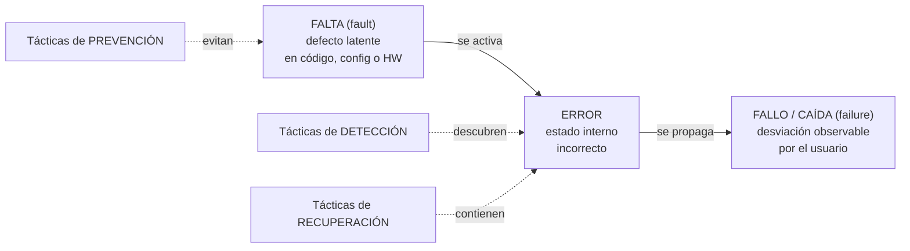

Toda táctica del Capítulo 4 corta esta cadena en algún punto. Prevenir actúa antes de que
la falta exista o se active; detectar descubre el error antes de que se vuelva fallo;
recuperar contiene el error para que no llegue al usuario. Esta sección no cambió respecto
a v1.0 — la taxonomía es del código (`FaultKind`), no de la topología de despliegue.

### 7.1 Clasificación en el código

| `FaultKind` | Significado | ¿Cuenta contra la disponibilidad? |
|---|---|---|
| `EXPECTED` | Resultado de negocio previsto | **No.** El sistema funciona correctamente |
| `FAULT` | Falta latente que acaba de activarse (excepción no prevista) | **Sí** |
| `ERROR` | Estado interno incorrecto, contenido dentro del tier | Parcialmente: se registra pero no siempre es visible |
| `FAILURE` | Desviación observable del servicio | **Sí** |

### 7.2 Catálogo de errores

| Código | HTTP | `kind` | Reintentable | Significado |
|---|---|---|---|---|
| `invalid_credentials` | 401 | EXPECTED | no | Usuario o contraseña incorrectos |
| `account_locked` | 423 | EXPECTED | no | Bloqueo temporal por intentos fallidos |
| `user_already_exists` | 409 | EXPECTED | no | El usuario ya está registrado |
| `validation_error` | 400 | EXPECTED | no | Datos de entrada inválidos (Bean Validation) |
| `malformed_request` | 400 | EXPECTED | no | Cuerpo de la petición no es JSON válido |
| `invalid_session` | 401 | EXPECTED | no | Token de acceso inválido/expirado, o refresh token inexistente/expirado |
| `data_unavailable` | 503 | FAILURE | sí | El tier de datos no responde (timeout, retry agotado o circuito abierto) — solo puede ocurrir en `/login` o `/refresh` |
| `internal_error` | 500 | FAULT | no | Excepción no prevista (falta latente activada) |

**Cambio respecto a v1.0:** `invalid_session` ya no representa una fila de sesión ausente
en Postgres — representa una firma JWT inválida o expirada, verificada en memoria. El
código y el `kind` no cambiaron; lo que cambió por completo es **cómo** se llega a ese
resultado, y el hecho de que ya no puede ser causado por una caída del tier de datos (antes
sí: si la BD estaba caída y la caché local tampoco tenía el token, `validate` también podía
terminar en `data_unavailable`; ahora esa ruta no existe).

`/api/auth/logout` tiene un comportamiento propio no capturado en esta tabla de errores
porque no es un error: si el tier de datos no responde, `logout` devuelve `202 Accepted`
con `{"revoked": false, "note": "..."}` en vez de fallar — es *best-effort* documentado en
ADR-08 (el token de acceso expira solo, aunque no se pueda revocar el refresh token en ese
momento).

**Punto crítico para la medición, sin cambios:** una contraseña equivocada es `EXPECTED`.
Si se contara como fallo, un usuario torpe bajaría la disponibilidad reportada y la
métrica del 99.99 % no significaría nada.

### 7.3 Vista de la gestión de excepciones

Las tablas anteriores dicen *qué* errores existen. Esta vista muestra **dónde vive la
gestión de excepciones dentro de la arquitectura** y qué recorrido hace una excepción desde
que se lanza hasta que el cliente ve una respuesta.

#### 7.3.1 Jerarquía: el tipo es el que transporta la decisión

`AppException` es **abstracta**: no se instancia nunca, solo se hereda.

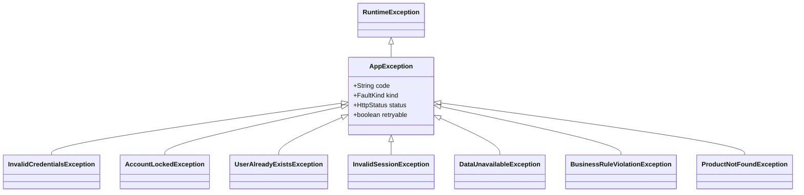

Cada subclase declara **de una vez** su código estable, su `FaultKind`, su status HTTP y si
vale la pena reintentar. Eso significa que ningún `catch` disperso por el código tiene que
decidir qué responder: la decisión viaja dentro del tipo de la excepción.

#### 7.3.2 Recorrido de una excepción

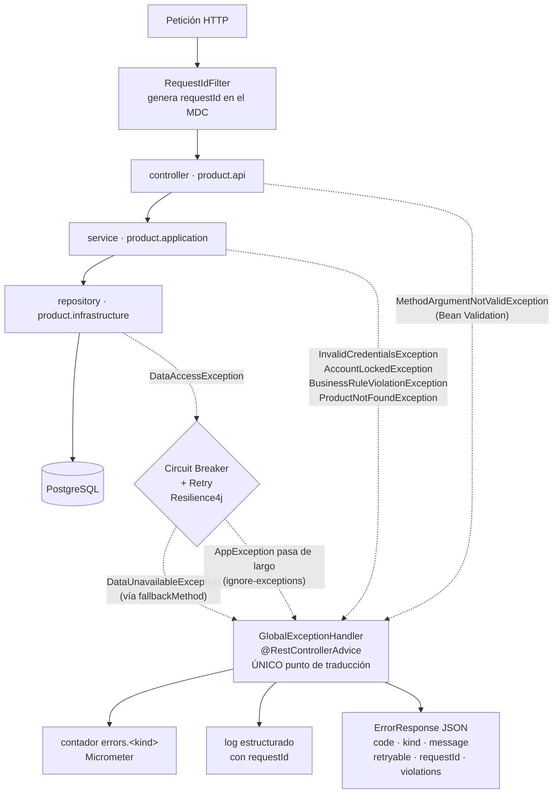

Tres propiedades que este diagrama hace visibles y que en una tabla no se ven:

1. **Hay un solo punto de traducción.** Ningún controlador construye una `ErrorResponse` a
   mano. Si mañana cambia el formato del cuerpo de error, cambia en un archivo.
2. **El circuit breaker está en el camino, pero deja pasar los errores de negocio.**
   `AppException` está en `ignore-exceptions` de Resilience4j, tanto del circuit breaker
   como del retry. Sin eso, un usuario tecleando contraseñas equivocadas contaría como
   fallas del tier de datos y podría **abrir el circuito para todos los demás**. Es la
   frontera entre "el sistema funciona y dice que no" y "el sistema está roto".
3. **Toda respuesta de error lleva el `requestId`** que generó `RequestIdFilter`, así que un
   error reportado por un usuario se puede rastrear hasta su línea de log exacta.

#### 7.3.3 Las tres tácticas de excepciones del Cap. 4, y dónde está cada una

El catálogo del Capítulo 4 tiene **tres** tácticas distintas relacionadas con excepciones, y
se confunden con facilidad porque comparten la palabra. Las tres están implementadas, en
puntos distintos de la arquitectura:

| Táctica | Qué hace | Dónde vive | Evidencia concreta |
|---|---|---|---|
| **Exception Prevention** (prevenir fallas, §8.4) | Impedir que la excepción llegue a existir | Borde de entrada y arranque | Bean Validation en los DTOs; tipos fuertes y `Optional` en vez de nulos; `TokenService.resolveSecret()` **se niega a arrancar** sin `JWT_SECRET` en el perfil `docker` |
| **Exception Detection** (detectar fallas, §8.1) | Darse cuenta de que ocurrió algo no previsto | `GlobalExceptionHandler` | El handler de `Exception.class` es el único que registra el *stack trace* completo: cualquier cosa que llegue ahí es, por definición, una falta latente que se acaba de activar |
| **Exception Handling** (recuperar de fallas, §8.2) | Que la excepción no tumbe el proceso y el cliente reciba algo útil | Banda transversal + fallbacks de Resilience4j | Ninguna excepción escapa como stack trace al cliente; los `fallbackMethod` degradan a `503 data_unavailable` en vez de propagar la falla; `logout` responde `202` en modo *best-effort* |

**Por qué esto no es una sola táctica repetida:** la prevención actúa *antes* (el error no
ocurre), la detección actúa *durante* (nos enteramos y lo clasificamos), y el manejo actúa
*después* (contenemos el daño y respondemos). Un sistema puede tener una y no las otras: un
`try/catch` genérico que se traga todo tiene manejo sin detección, y es exactamente el
antipatrón que la separación de `FaultKind` evita aquí.

#### 7.3.4 Dónde vive cada validación

La gestión de excepciones no empieza cuando algo falla, sino en dónde se decide que algo es
inválido. Hay tres capas, y cada regla vive en **una sola**:

| Tipo | Dónde | Respuesta | Ejemplo |
|---|---|---|---|
| **Estructural** — falta el dato o no tiene la forma correcta | Bean Validation en el DTO (capa `api`) | `400 validation_error` | `@NotBlank`, `@NotNull`, `@Size` |
| **Semántica de negocio** — el dato está bien formado pero la regla lo rechaza | Motor de reglas (capa `application`) | `422 business_rule_violation` con `violations[]` | precio > 0, stock ≥ 0, unicidad de nombre |
| **Invariante inviolable** — no debe poder existir en la base | Constraint de BD | Traducida a `422` por el servicio | `UNIQUE(name)`, `CHECK (stock >= 0)` |

Los dos códigos HTTP distintos no son un detalle de implementación: hacen **visible desde el
cliente** la separación entre las dos primeras capas. Y la tercera se duplica a propósito
con la segunda, porque cumplen papeles distintos — el backend produce el *mensaje* útil para
el usuario, la constraint garantiza el *invariante* aunque una ruta de código futura se
salte el motor de reglas. Es la diferencia entre "validar" y "no poder violar".

---

## 8. Tácticas de disponibilidad aplicadas (Cap. 4)

### 8.0 Vista de tácticas sobre la arquitectura

Las tablas de §8.1 a §8.4 listan las tácticas por categoría del libro. Esta vista las
coloca **en el punto de la arquitectura donde actúan**, que es la pregunta que una tabla no
responde: no *cuáles* tácticas hay, sino *dónde* está cada una.

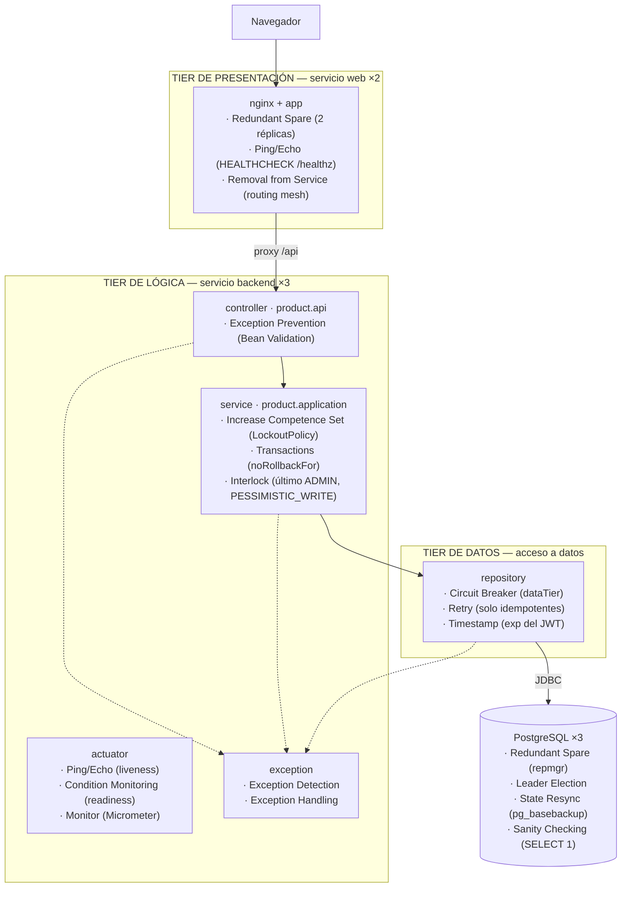

**Cómo leer este diagrama.** Cada táctica aparece una sola vez, en la caja donde está
implementada. Tres lecturas que salen de aquí y que las tablas no dejan ver:

- **La redundancia ya no tiene huecos.** Los tres tiers y la base de datos tienen
  Redundant Spare. En v1.0, el tier de presentación no existía y Postgres era instancia
  única.
- **El circuit breaker está en el tier de datos, no en el de lógica.** Protege exactamente
  la frontera remota que puede fallar, y por eso `/api/auth/validate` —que no llega hasta
  esa caja— no puede responder `503` por causa de la base de datos.
- **La banda de excepciones cruza los tres tiers** (las flechas punteadas). Es la única
  preocupación transversal del diseño, y por eso se dibuja como destino de todos y no como
  un paso más del recorrido.

### 8.1 Detectar fallas

| Táctica | Implementación | Escenario que atiende |
|---|---|---|
| **Ping/Echo** | `GET /actuator/health/liveness` en el tier de lógica y `GET /healthz` en el de presentación, consultados por el `HEALTHCHECK` de Docker en cada tarea de Swarm. La sonda del tier web **no** consulta al backend a propósito: si lo hiciera, una caída del tier de lógica sacaría de rotación a los servidores web y el usuario no vería ni la página de error (mismo criterio que ADR-03) | ESC-D1, ESC-D6 |
| **Sanity Checking / Self-Test** | `DataTierHealthIndicator`: `SELECT 1` con timeout corto | ESC-D2, ESC-D7 |
| **Condition Monitoring** | `readiness` evalúa el estado de las dependencias antes de aceptar tráfico; `repmgrd` monitorea la salud del primario en cada standby | ESC-D6, ESC-D7 |
| **Monitor** | Actuator + Micrometer: contador `errors.<kind>`, etiquetado por `code`; estado del circuito expuesto en `/api/diagnostics` | Todos |
| **Heartbeat** | Tarea `@Scheduled` que emite un latido con el `NODE_ID` (ahora derivado del hostname templado por Swarm, no fijado a mano) | ESC-D1 |
| **Exception Detection** | `GlobalExceptionHandler`, handler de `Exception.class`: es el **único** que registra el stack trace completo, porque cualquier excepción que llegue ahí es por definición una falta latente recién activada. Clasifica cada error con un `FaultKind` y lo cuenta en `errors.<kind>` (ver §7.3.2) | ESC-D4 |
| **Timestamp** | `createdAt` / `expiresAt` en el refresh token y en el JWT (claim `exp`), para detectar estado obsoleto | ESC-D2 |

**Diferencia que conviene tener clara en la sustentación:** *Ping/Echo* lo inicia el
monitor (pregunta y espera respuesta); *Heartbeat* lo inicia el componente monitoreado
(anuncia que sigue vivo). El primero detecta también fallas de red hacia el nodo; el
segundo no requiere que el monitor conozca a todos los nodos.

### 8.2 Recuperar de fallas — preparación y reparación

| Táctica | Implementación | Escenario |
|---|---|---|
| **Redundant Spare (active / hot spare)** | 2 réplicas del servicio `web` (nuevo: el tier de presentación no existía); 3 réplicas activas del backend tras el *routing mesh* de Swarm (antes 2, tras nginx); 3 nodos de Postgres con `repmgr` (Fase 4). **Ya no queda ningún tier sin redundancia** | ESC-D1, ESC-D7 |
| **Retry** | Resilience4j con backoff exponencial y *jitter*, solo sobre operaciones idempotentes (ADR-05) — ahora solo relevante para el 5 % del tráfico | ESC-D3 |
| **Exception Handling** | Ninguna excepción termina el proceso ni escapa como stack trace al cliente: `@RestControllerAdvice` traduce cada una a un `ErrorResponse` con código estable, y los `fallbackMethod` de Resilience4j degradan a `503 data_unavailable` en vez de propagar la falla. `logout` es *best-effort*: responde `202` si no pudo revocar. **Recorrido completo en §7.3.2** | ESC-D4 |
| **Rollback** | `scripts/rollback.sh` → `docker service rollback`, declarativo (ver ESC-P2) | ESC-P2 |

**Lo que ya no aparece aquí, y por qué es la noticia principal de esta sección:**
*Graceful Degradation* (la caché local de v1.0, ADR-04) no está en esta tabla porque ya
no hace falta degradar nada — `validate` no tiene una dependencia de la que degradarse
(ADR-08). Esto no es una táctica más fuerte reemplazando a una más débil: es la
eliminación completa de un modo de falla, algo que ninguna táctica del catálogo del Cap. 4
por sí sola logra — las tácticas de recuperación **contienen** el daño de una falla; esta
decisión evita que la falla exista para esa operación.

El *jitter* en el backoff no es un detalle: sin él, todos los clientes reintentan en el
mismo instante y producen una tormenta de reintentos que impide que el servicio caído se
levante.

### 8.3 Recuperar de fallas — reintroducción

| Táctica | Implementación | Escenario |
|---|---|---|
| **Reconfiguration** | Swarm reprograma automáticamente una tarea de `backend` caída (ESC-D1) y `repmgrd` promueve un standby de Postgres (ESC-D7); ninguno de los dos era automático en v1.0 | ESC-D1, ESC-D7 |
| **State Resync** | El nodo de Postgres reincorporado se re-clona (`pg_basebackup`) desde el primario vigente tras vaciar su volumen — la forma en que Postgres/repmgr resuelve la reintroducción sin arriesgar split-brain (ADR-11) | ESC-D7 |
| **Escalating Restart** | Reducido a la sola falla que Swarm/repmgr no cubren: la muerte real del disco de un nodo no-manager, documentada como deuda (DA-7), no automatizada | — |

**Cambio de calificación respecto a v1.0:** *Reconfiguration* estaba marcada como "No
soportada" en la sección 13 de v1.0 ("Sin orquestador; la reconfiguración es manual").
Con Swarm, pasa a "Sí" — es, junto con la eliminación de la caché de sesiones, el cambio
de calificación más importante de esta tabla.

### 8.4 Prevenir fallas

| Táctica | Implementación | Escenario |
|---|---|---|
| **Removal from Service** | `readiness` en rojo saca la tarea de rotación del *routing mesh* sin matarla (ADR-03) | ESC-D6 |
| **Transactions** | `@Transactional(noRollbackFor = AppException.class)` en `AuthService.login()` (ADR-07) | ESC-D5 |
| **Increase Competence Set** | Bloqueo por intentos fallidos y validación de entrada | ESC-D5 |
| **Exception Prevention** | Validación con Bean Validation en el borde; tipos fuertes; `Optional` en lugar de nulos; **negarse a arrancar sin `JWT_SECRET` en el perfil `docker`** (nuevo en Fase 1: una clave por defecto en un despliegue real es una falta latente crítica) | ESC-D4, ADR-08 |

---

## 9. Tácticas de desplegabilidad aplicadas (Cap. 5)

### 9.1 Las tres cualidades exigidas

El Capítulo 5 dice que un despliegue debe ser **granular, controlable y eficiente**:

| Cualidad | Cómo se logra aquí |
|---|---|
| **Granular** | Cada tier es una unidad desplegable independiente; en Postgres, cada nodo del cluster es además una unidad independiente (Fase 4) |
| **Controlable** | El `update_config` de Swarm avanza tarea por tarea, condicionado al `HEALTHCHECK`, con rollback automático declarativo — ya no orquestado a mano por un script |
| **Eficiente** | Todo el despliegue es un comando (`deploy.sh`); el *cycle time* se mide (115 s), no se estima |

### 9.2 Tácticas

| Categoría | Táctica | Implementación |
|---|---|---|
| Gestionar el pipeline | **Script Deployment Commands** | `deploy.sh`, `rolling-upgrade.sh`, `rollback.sh`: cero pasos manuales |
| Gestionar el pipeline | **Scale Rollouts** | `update_config` de Swarm: una réplica a la vez, `start-first`, verificando `HEALTHCHECK` entre pasos |
| Gestionar el pipeline | **Rollback** | `docker service rollback`, declarativo (antes: reetiquetar una imagen a mano) |
| Gestionar el sistema desplegado | **Feature Toggle** | `features.new-dashboard` por variable de entorno (`features.session-cache` se eliminó junto con ADR-04: ya no hay nada que activar/desactivar) |
| Gestionar el sistema desplegado | **Package Dependencies** | Imagen Docker multietapa: dependencias congeladas en el artefacto |
| Gestionar el sistema desplegado | **Manage Service Interactions** | Apagado ordenado (`graceful shutdown`) para no cortar peticiones en vuelo |

### 9.3 Pipeline

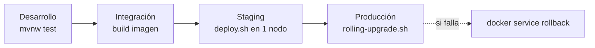

**Cycle time** = tiempo desde el *commit* hasta que el cambio está sirviendo tráfico en
producción. Medido en **115 s** (`rolling-upgrade.sh`, E5), con **0 peticiones fallidas**
en una sonda concurrente de 133 muestras.

---

## 10. Patrones arquitectónicos

| Patrón | Dónde | Qué aporta |
|---|---|---|
| **Three-tier / N-tier** | Estructura global | Presentación, lógica y datos como responsabilidades separadas; PostgreSQL es el recurso externo detrás del tier de datos, no un tier (ADR-02) |
| **Separación presentación / coordinación / estado** | Tier de presentación (`frontend/src/`) | El mismo objetivo que un MVC, cortado por lo que cambia junto: `platform/` (estado y transporte), `crud/` (vista genérica y coordinación) y `resources/` (descriptores). Regla verificable: `fetch(` productivo solo en `platform/http.js` y estado de sesión solo en `platform/session.js` (ADR-12, ADR-F01) |
| **Reverse Proxy** | Servicio `web` → `/api` | Un solo origen para el navegador: elimina el CORS y saca la URL del backend del código del cliente (ADR-12) |
| **Layers** | Interior del tier de lógica | Dependencias en un solo sentido: controller → service → repository |
| **Repository** | `repository`, `product.infrastructure` | **Es la frontera del tier de datos**: por encima se trabaja con objetos de dominio, por debajo se conoce JPA. Oculta la decisión de motor de persistencia (ADR-02) |
| **Service Mesh liviano (routing mesh de Swarm)** | Infraestructura de Swarm | Reemplaza a Load-Balanced Cluster + nginx: redundancia activa sin un balanceador desplegado como componente propio (ADR-10) |
| **Circuit Breaker** | Acceso al tier de datos (`/login`, `/refresh`) | Evita el fallo en cascada y el agotamiento del pool, ahora acotado al 5 % del tráfico |
| **Leader Election** | Cluster de Postgres con `repmgr` | Base de ESC-D7: exactamente un primario en todo momento, con promoción automática (Fase 4) |
| **Rolling Upgrade declarativo** | `stack.yml` → `update_config` | Despliegue sin interrupción (ESC-P1), gestionado por el orquestador en vez de por un script imperativo |
| **Health Endpoint Monitoring** | Actuator | Base de detección y de *Removal from Service* |
| **Stateless Session Token (JWT)** | `TokenService` | Elimina la afinidad de réplica y la dependencia del tier de datos en el 95 % del tráfico (ADR-08) |

La relación entre patrones y tácticas es la del Capítulo 3: **un patrón agrupa varias
tácticas**. El *routing mesh* de Swarm, por ejemplo, combina Redundant Spare, Ping/Echo
(vía `HEALTHCHECK`) y Removal from Service — el mismo paquete que antes ofrecía
Load-Balanced Cluster con nginx, pero sin el componente que era, él mismo, un SPOF.

---

## 11. Análisis cuantitativo de disponibilidad

### 11.1 Fórmulas

$$A = \frac{MTBF}{MTBF + MTTR}$$

- **MTBF** — tiempo medio entre fallas
- **MTTR** — tiempo medio de reparación
- Componentes **en serie** (todos necesarios): $A_{total} = \prod A_i$
- Componentes **en paralelo** (redundantes, basta uno): $A_{total} = 1 - \prod (1 - A_i)$

### 11.2 Por qué el modelo de v1.0 ya no aplica

El modelo de v1.0 trataba el sistema como **una sola cadena en serie**:
$A_{sistema} = A_{nginx} \times A_{backend\ pool} \times A_{postgres}$, porque **toda**
petición pasaba por los tres componentes. Esa es la razón matemática de que el resultado
fuera 99.85 %: en una cadena en serie, la disponibilidad nunca supera al eslabón más
débil, y con dos SPOF (nginx, Postgres) en la cadena, no había forma de superar el 99.9 %
sin eliminarlos.

La Fase 1 (ADR-08) rompe esa premisa: **ya no toda petición pasa por el tier de datos**.
El modelo correcto no es una cadena única, es una **mezcla ponderada de dos caminos**:

$$A_{sistema} = (1 - r) \times A_{validate} + r \times A_{login}$$

donde $r$ es la fracción de tráfico que es `/login` o `/refresh` (5 % por defecto,
medido/configurable en `scripts/probe.sh` vía `LOGIN_RATIO`), y:

$$A_{validate} = A_{backend\ pool} \qquad A_{login} = A_{backend\ pool} \times A_{bd}$$

`validate` (95 % del tráfico) depende solo del tier de lógica. `login`/`refresh` (5 %)
siguen siendo una cadena en serie clásica, backend × BD — ahí es donde sí aplica el
modelo de v1.0, pero acotado a una fracción pequeña del tráfico total.

### 11.3 Topología y parámetros medidos

**Tier de lógica** — 3 réplicas en redundancia activa tras el *routing mesh* de Swarm:

$$A_{backend\ pool} = 1 - (1 - A_{replica})^3$$

**Tier de datos** — modelado como un componente lógico único, cuyo MTTR cambia según la
fase implementada (con o sin Fase 4); no hace falta modelar cuántos nodos hay detrás,
basta con la disponibilidad efectiva resultante para el backend.

Parámetros de entrada, cada uno con su fuente (ninguno es un número puesto a ojo — el
detalle completo está en `scripts/availability-model.py`, `DEFAULTS_DOC`):

| Parámetro | Valor | Fuente |
|---|---|---|
| MTBF de una réplica de backend | 720 h (30 días) | **Asunción documentada**: no se puede medir en una demo corta; consistente con tasas de falla típicas de instancias/contenedores en la nube pública |
| MTTR de una réplica de backend | **28 s** | **Medido** — E2, dos corridas independientes contra el stack real, mismo resultado ambas veces |
| MTBF del tier de datos | 2000 h | **Asunción documentada**: es el componente menos disponible del sistema con o sin Fase 4, pero queda fuera del camino crítico del 95 % del tráfico |
| MTTR del tier de datos, **sin** Fase 4 | 3600 s (~1 h) | **Asunción documentada**, el escenario original del enunciado: recuperación manual de una instancia única |
| MTTR del tier de datos, **con** Fase 4 | **29 s** | **Medido** — E9, dos corridas independientes, mismo resultado ambas veces (failover automático de `repmgr`) |
| Mezcla de tráfico | 5 % login / 95 % validate | Configuración de `probe.sh`, consistente con un patrón de uso realista |

### 11.4 Resultado

**Escenario 1 — arquitectura original (sin Fase 1 ni Fase 4)**, para contraste directo con
v1.0: BD en el 100 % del camino crítico, MTTR manual de 1 h.

$$A_{sistema} = 1.00 \times (A_{backend\ pool} \times A_{bd}) = 99.8613\%$$

**≈ 729.5 min/año de caída — NO cumple** el objetivo de 99.99 %. Es, dentro del margen de
las asunciones, el mismo resultado que v1.0 (99.85 %): confirma que el modelo nuevo no
está "arreglado a la fuerza" para dar el resultado que se quiere, reproduce la conclusión
de la versión anterior cuando se le da la misma topología.

**Escenario 2 — con Fase 1 (JWT), sin Fase 4** (Postgres de instancia única, MTTR manual
de 1 h):

$$A_{sistema} = 0.95 \times 100.0000\% + 0.05 \times 99.8613\% = 99.9931\%$$

**≈ 36.5 min/año de caída — CUMPLE** el objetivo, con margen. Este es el resultado central
del trabajo: **la Fase 1 por sí sola ya cierra la brecha**, sin necesidad de redundancia en
el tier de datos. Es la razón por la que la Fase 4 se documenta como refuerzo, no como
requisito (ADR-11).

**Escenario 3 — con Fase 1 y Fase 4** (MTTR de Postgres medido en 29 s vía `repmgr`):

$$A_{sistema} = 0.95 \times 100.0000\% + 0.05 \times 99.9996\% = 99.999980\%$$

**≈ 6.4 s/año de caída proyectada — CUMPLE** con un margen de más de tres órdenes de
magnitud sobre el presupuesto de 52.6 min/año. Comando exacto para reproducir:

```bash
python3 scripts/availability-model.py --replica-mttr-seconds 28 --db-mttr-seconds 29
```

| Escenario | Disponibilidad | Downtime/año proyectado | ¿Cumple 99.99 %? |
|---|---|---|---|
| Original (sin Fase 1 ni 4) | 99.8613 % | 729.5 min | **No** |
| Con Fase 1, sin Fase 4 | 99.9931 % | 36.5 min | **Sí** |
| Con Fase 1 y Fase 4 | 99.999980 % | 6.4 s | **Sí**, con amplio margen |

### 11.5 Interpretación — el hallazgo central del trabajo

**Sacar al tier de datos del camino crítico vale más que hacerlo redundante.** En v1.0, la
conclusión era que duplicar réplicas del backend no movía la aguja porque el cuello de
botella estaba en los SPOF de la cadena en serie. La conclusión de v2.0 es más específica
todavía: **ni siquiera hace falta eliminar el SPOF del tier de datos** para alcanzar el
objetivo — basta con sacarlo del camino crítico del tráfico dominante. La Fase 4
(eliminar el SPOF de verdad, con `repmgr`) sigue siendo valiosa — lleva el sistema de
36.5 min/año a 6.4 s/año, casi tres órdenes de magnitud — pero es una optimización sobre
una base que **ya cumplía**, no una condición para cumplir.

Esto invierte la lección de v1.0 sin contradecirla: ambas versiones coinciden en que
"agregar réplicas donde ya sobra redundancia no mueve la aguja" (el pool de backend estaba
en 99.998 % desde v1.0 y sigue prácticamente en 100 % ahora). Donde difieren es en **dónde**
está la palanca de mayor impacto: v1.0 concluía que había que eliminar los SPOF; v2.0
muestra que, primero, hay una palanca más barata y más grande — cambiar **qué** depende de
qué.

---

## 12. Plan de medición y experimentos

Hay dos niveles de verificación, y ninguno sustituye al otro. Los tests automatizados
(`./mvnw test`, 45 casos, corren en segundos sin Docker sobre H2) prueban que la **lógica**
hace lo que dice que hace. Los experimentos de caos de esta sección prueban que el
**sistema desplegado** (réplicas, cluster de Postgres, red overlay) se comporta igual bajo
condiciones reales. A diferencia de v1.0, esta sección **ya no es una plantilla vacía**:
todos los experimentos listados abajo se ejecutaron contra el stack de Swarm real el
12 de agosto de 2026, y los resultados son los que se obtuvieron, no una expectativa.

### 12.0 Suite de tests automatizados

| Clase | Tipo | Qué prueba |
|---|---|---|
| `LockoutPolicyTest` | Unitario | Lógica de bloqueo en aislamiento (sin Spring) |
| `TokenServiceTest` | Unitario | Emisión/validación/expiración del JWT, rotación y revocación del refresh token, con `RefreshTokenRepository` simulado — incluye el caso de arranque sin `JWT_SECRET` (docker vs. no-docker) |
| `AuthServiceTest` | Unitario | Reglas de registro/login/refresh/logout, con `UserRepository`/`TokenService` simulados y BCrypt real |
| `AuthControllerIT` | Integración (Spring real + H2) | Contrato HTTP completo de `/api/auth` y `/api/diagnostics`, incluida la rotación de refresh token y el rechazo de un token ya usado |
| `AvailabilityIT` | Integración (Spring real + H2) | Taxonomía `FaultKind` end-to-end, correlation id, salud, y el escenario de fuerza bruta (ESC-D5) |
| `StatelessAccessTokenIT` | Integración (Spring real + H2) | **Criterio de terminado de la Fase 1**: cierra el `DataSource` a mitad del test y confirma que `/api/auth/validate` sigue respondiendo `200` |

`AvailabilityIT` y `StatelessAccessTokenIT` merecen mención aparte porque son la
regresión automatizada de defectos y decisiones que, sin ellas, dependerían de que alguien
se acuerde de probarlos a mano:

1. **Resilience4j enrutaba cualquier excepción al `fallbackMethod`** (defecto histórico):
   una password incorrecta llegaba a responder `503 data_unavailable` en vez de
   `401 invalid_credentials`. `AvailabilityIT` verifica el `kind` exacto del cuerpo de
   error, no solo el código HTTP.
2. **El contador de intentos fallidos se revertía por el rollback transaccional por
   defecto de Spring** (ADR-07): `unaCuentaBloqueadaPorFuerzaBrutaNoAfectaAOtrosUsuarios`
   agota los 5 intentos y verifica que el sexto siga bloqueado.
3. **`validate` sigue en pie con la BD abajo** (ADR-08, el criterio de terminado de la
   Fase 1): sin `StatelessAccessTokenIT`, esta garantía dependería de que nadie rompa por
   accidente la ausencia de dependencia del tier de datos en una refactorización futura.

### 12.1 Instrumentos

- `scripts/probe.sh` — sonda de disponibilidad contra el *routing mesh* de Swarm. Mezcla
  configurable de `/login` (5 % por defecto) y `/validate` (95 %); clasifica cada muestra
  con la taxonomía de la sección 7 (los `EXPECTED` **no** cuentan como fallo); calcula
  disponibilidad global y por operación, ventanas de caída con su duración, MTBF/MTTR
  observados y percentiles de latencia; deja un CSV crudo en `results/`.
- `scripts/chaos.sh` — mata una tarea de `backend` y, por separado, apaga/revive el tier
  de datos completo (los 3 nodos a la vez).
- `scripts/chaos-db-failover.sh` (Fase 4) — identifica el primario real del cluster
  `repmgr`, lo apaga de forma sostenida, cronometra la promoción, y reincorpora al viejo
  primario de forma segura (vaciando su volumen para evitar split-brain, ver ADR-11).
- `scripts/availability-model.py` — el modelo de la sección 11, ejecutable con los MTTR
  medidos por los instrumentos anteriores.

### 12.2 Experimentos ejecutados y resultados reales

Cada fila enlaza al CSV o log crudo de la corrida real en
[`docs/evidencia/`](evidencia/README.md) — el resumen de esta tabla no es la evidencia en
sí, es la lectura de un archivo que también quedó commiteado.

| # | Experimento | Acción | Resultado medido | Escenario | Evidencia cruda |
|---|---|---|---|---|---|
| E1 | Línea base con mezcla realista | `probe.sh` 150 s, sin perturbación deliberada, con el cluster de Postgres de instancia única (Fase 3) | 126 muestras (8 login / 118 validate); 1 fallo real capturado — ver E4 | ESC-D2 | [`probe-20260812_204156.csv`](evidencia/probe-20260812_204156.csv) |
| E2 | Muerte de una réplica de backend | `docker kill` sobre una tarea de `backend`, vía `chaos.sh` | **28 s** de reprogramación hasta 3/3 sanas de nuevo. Repetido dos veces, mismo resultado | ESC-D1, ESC-D6 | [`chaos-20260812_204201.log`](evidencia/chaos-20260812_204201.log), [`chaos-20260812_220802.log`](evidencia/chaos-20260812_220802.log) |
| E3 | Escalado manual 3→1→3 | `docker service scale auth_backend=1` y de vuelta a `=3` | Convergencia limpia ambas veces; `liveness` en 200 antes, durante y después; sin ventana de caída | ESC-D1 | Verificado con `curl` en la sesión de trabajo; no generó un archivo propio |
| E4 | Caída del tier de datos completo (instancia única, Fase 3) | `chaos.sh` detiene Postgres ~21 s durante un `probe.sh` de 150 s | **`validate`: 100 % de disponibilidad durante toda la caída.** `login`: 87.5 % (1 fallo real de 8 muestras, clasificado `FAILURE`, exactamente durante la ventana de caída). Disponibilidad global de la muestra: 99.21 % — **por debajo** del objetivo, y **así se esperaba**: una ventana de 150 s con una caída inyectada no puede demostrar un presupuesto de 52.6 min/año; para eso está el modelo de la sección 11, no la sonda | ESC-D2 | [`probe-20260812_204156.csv`](evidencia/probe-20260812_204156.csv), [`chaos-20260812_204201.log`](evidencia/chaos-20260812_204201.log) |
| E5 | Rolling upgrade con sonda concurrente | `rolling-upgrade.sh` mientras corre `probe.sh` (140 s, intervalo 0.3 s) | *Cycle time*: **115 s**. **133 muestras, 0 fallidas, 100 % de disponibilidad observada** durante el despliegue completo | ESC-P1 | [`probe-20260812_220509.csv`](evidencia/probe-20260812_220509.csv) |
| E6 | Rollback | `docker service rollback auth_backend` | Convergencia confirmada por el propio comando (`--detach=false`); no se midió un *cycle time* de reversión con un defecto real inyectado | ESC-P2 | Salida de consola de la sesión de trabajo; no generó un archivo propio |
| E7 | Fuerza bruta | 5 intentos fallidos + 1 con password correcta, contra una cuenta; una segunda cuenta en paralelo | Bloqueo exacto al 5.º intento (`423 account_locked`); la segunda cuenta autentica con normalidad — **0 % de degradación cruzada** (`AvailabilityIT`, sección 12.0) | ESC-D5 | `./mvnw test` (reproducible en cualquier corrida) |
| E8 | Failover del primario de Postgres, primer intento | `docker kill` sobre el primario, vía `chaos-db-failover.sh` (primera versión) | **Sin promoción**: Swarm revivió el mismo contenedor en ~8 s, más rápido que la ventana de reconexión de `repmgrd`. Resultado negativo informativo — llevó a corregir el experimento (ver ADR-11) | ESC-D7 | [`chaos-db-failover-20260812_211916.log`](evidencia/chaos-db-failover-20260812_211916.log) |
| E9 | Failover del primario de Postgres, corregido | `docker service scale =0` sobre el primario; medición hasta que un standby queda como primario; reincorporación segura del viejo primario | **MTTR = 29 s**, dos corridas independientes, mismo resultado ambas veces. `POST /api/auth/login` inmediatamente después de la promoción responde `200` sin reiniciar el backend. Reincorporación limpia del nodo demovido confirmada (sin split-brain) tras corregir el procedimiento | ESC-D7 | [`chaos-db-failover-20260812_212301.log`](evidencia/chaos-db-failover-20260812_212301.log) (revela el split-brain), [`chaos-db-failover-20260812_213020.log`](evidencia/chaos-db-failover-20260812_213020.log) (corregido) |
| E10 | Caída del tier de datos completo (cluster repmgr, Fase 4) | `chaos.sh` detiene los 3 nodos de Postgres a la vez, revive los 3 a la vez, con `probe.sh` (90 s) concurrente | Los 3 nodos vuelven sin divergencia (se apagaron juntos, ninguno quedó desactualizado respecto a otro) — cluster re-formado sin riesgo de split-brain. **0 muestras fallidas** en la sonda concurrente | ESC-D2, ESC-D7 | [`chaos-20260812_220802.log`](evidencia/chaos-20260812_220802.log), [`probe-20260812_220819.csv`](evidencia/probe-20260812_220819.csv) |

### 12.3 Advertencia metodológica

La disponibilidad medida en una ventana de minutos **no es** la disponibilidad anual. E4
lo demuestra en los dos sentidos: la muestra de 150 s dio 99.21 %, muy por debajo del
objetivo, precisamente porque se inyectó una falla real dentro de una ventana corta — una
ventana sin incidentes habría dado 100 %, igual de poco representativo del año completo.
Lo que estas mediciones prueban es el **comportamiento cualitativo** de las tácticas
(¿se detectó?, ¿se recuperó?, ¿en cuánto?), y de ahí se alimenta el MTTR del modelo de la
sección 11. La cifra anual sale del modelo, no de la sonda — y por eso hace falta un
modelo, no solo una sonda que corra más tiempo (harían falta meses de muestreo continuo
para que una sonda por sí sola tuviera significancia estadística sobre un presupuesto de
52.6 min/año).

---

## 13. Cuestionario y priorización de tácticas

Formato del Capítulo 3: para cada táctica, si está soportada, la decisión de diseño y su
ubicación. Se agrega la **priorización**, porque el catálogo del libro es deliberadamente
exhaustivo y aplicarlo entero no es una meta: el Cap. 4 lista 25 tácticas de
disponibilidad, el Cap. 5 nueve de desplegabilidad y el Cap. 8 ocho de modificabilidad.
Adoptarlas todas multiplicaría piezas que operar sin mover las medidas de respuesta, y
varias son directamente inaplicables a este dominio.

**La pregunta que responde esta sección no es "¿cuáles existen?" sino "¿cuáles elegimos y
por qué esas".**

### 13.0 Criterio de priorización

Cada táctica se califica en tres ejes, con escala **A**lto / **M**edio / **B**ajo:

| Eje | Qué mide |
|---|---|
| **Impacto** | Cuánto mueve la *medida de respuesta* del escenario que la táctica atiende. Una táctica que no cambia ningún número medido tiene impacto B por elegante que sea |
| **Costo** | Esfuerzo de implementación **más** la complejidad permanente que agrega: piezas nuevas que operar, dependencias, código que mantener |
| **Riesgo si se omite** | Qué tan expuesto queda el sistema sin ella |

De ahí sale la prioridad:

| Prioridad | Significado |
|---|---|
| **P1 — adoptada** | Impacto alto con costo asumible. Sostiene directamente un escenario con medida verificada |
| **P2 — adoptada con límite** | Se implementa con alcance acotado a propósito, y el límite queda documentado en vez de escondido |
| **P3 — descartada conscientemente** | Impacto bajo sobre *los escenarios de este sistema*, o costo desproporcionado frente a lo que aporta. Descartar no es olvidar: cada P3 lleva su razón |

Una aclaración que evita malinterpretar la tabla: **P3 no significa "táctica mala"**.
*Voting* es excelente en sistemas de control redundante y aquí no aplica porque no hay
réplicas que calculen lo mismo. La prioridad es relativa a este sistema y a sus escenarios,
no una calificación del catálogo.

### 13.1 Disponibilidad (Cap. 4)

| Táctica | ¿Soportada? | Imp. | Costo | Riesgo si se omite | **Prioridad** | Decisión y ubicación |
|---|---|---|---|---|---|---|
| Ping/Echo | Sí | A | B | A | **P1** | `HEALTHCHECK` de Docker sobre `liveness` y `/healthz`, consumido por el *routing mesh* |
| Monitor | Sí | A | B | A | **P1** | Micrometer + `/actuator/metrics`; contador `errors.<kind>` — base de toda medición |
| Condition Monitoring | Sí | A | B | A | **P1** | `DataTierHealthIndicator`; `repmgrd` sobre el primario. Alimenta `readiness` y ESC-D7 |
| Exception Detection | Sí | A | B | A | **P1** | `GlobalExceptionHandler` (§7.3). Ninguna excepción pasa inadvertida |
| Exception Handling | Sí | A | B | A | **P1** | Banda transversal + `fallbackMethod`. 0 stack traces expuestos |
| Exception Prevention | Sí | A | B | M | **P1** | Bean Validation, tipos fuertes; arranque bloqueado sin `JWT_SECRET` en `docker` |
| Redundant Spare | Sí | A | M | A | **P1** | 2 réplicas de `web`, 3 de `backend`, 3 nodos de Postgres. Ningún tier sin redundancia |
| Reconfiguration | Sí *(era "No" en v1.0)* | A | B | A | **P1** | Swarm reprograma tareas caídas; `repmgrd` promueve standbys. El costo es B porque lo aporta el orquestador |
| Removal from Service | Sí | A | B | A | **P1** | `readiness` + *routing mesh* (ADR-03) |
| Rollback | Sí | A | B | A | **P1** | `docker service rollback`, declarativo (ESC-P2) |
| State Resync | Sí *(era "Parcial")* | A | M | A | **P1** | Re-clonado (`pg_basebackup`) tras vaciar el volumen. Mecanismo nativo de repmgr |
| Transactions | Sí | A | B | A | **P1** | `@Transactional(noRollbackFor = AppException.class)` en `login()` (ADR-07) |
| Timestamp | Sí | M | B | M | **P1** | `exp` del JWT; `expiresAt` del refresh token. Es lo que hace viable la sesión sin estado |
| Sanity Checking | Sí | M | B | M | **P1** | `SELECT 1` con timeout corto |
| Increase Competence Set | Sí | M | B | M | **P1** | `LockoutPolicy` + ADR-07: estados adversos previstos, no excepcionales |
| Retry | Sí | M | B | M | **P2** | Resilience4j, **solo idempotentes**, acotado al 5 % del tráfico. Extenderlo a escrituras introduciría duplicados: el límite es la decisión |
| Self-Test | Sí | M | B | M | **P2** | `SELECT 1` en `readiness`. Se solapa parcialmente con Sanity Checking; no se construyó un self-test más amplio |
| Heartbeat | Sí | B | B | B | **P2** | `@Scheduled` con `NODE_ID`. Complementa a Ping/Echo, que ya cubre el caso principal |
| Escalating Restart | Parcial | M | A | M | **P2** | Automatizado para caída de contenedor; la muerte del disco de un nodo no-manager sigue manual (DA-7). Resolverlo exige almacenamiento distribuido |
| Predictive Model | **No** | M | A | **A** | **P3** | Exige series temporales y umbrales calibrados con histórico que no existe. **Es el riesgo R-1**, asumido a conciencia |
| Voting | **No** | B | A | B | **P3** | Requiere réplicas que calculen lo mismo y comparen resultados. No aplica: las réplicas atienden peticiones distintas |
| Ignore Faulty Behavior | **No** | B | B | B | **P3** | No hay fuentes externas no confiables que ignorar |
| Shadow | **No** | B | A | B | **P3** | Exige duplicar tráfico a un entorno paralelo. Fuera del alcance |
| Nonstop Forwarding | **No** | B | A | B | **P3** | Propia de elementos de red con plano de control y de datos separados |
| Graceful Degradation | **No — eliminada a propósito** | — | — | — | **P3** | `validate` ya no tiene dependencia del tier de datos que degradar (ADR-08 supera a ADR-04). **La ausencia es la mejora, no una carencia**: no se contiene el daño de una falla, se elimina la falla |

**Lectura de la tabla.** Las 15 P1 son las que sostienen los escenarios con medida
verificada. Las cuatro P2 comparten un patrón: están implementadas *con un límite explícito*
—Retry solo en idempotentes, Escalating Restart solo hasta la caída de contenedor— y ese
límite es la decisión, no un descuido. Las seis P3 se reparten en dos grupos: cinco
inaplicables al dominio y **una sola descartada por costo teniendo riesgo alto**
(Predictive Model), que por eso mismo aparece como R-1 en §13.4.

### 13.2 Desplegabilidad (Cap. 5)

| Táctica | ¿Soportada? | Imp. | Costo | Riesgo si se omite | **Prioridad** | Decisión y ubicación |
|---|---|---|---|---|---|---|
| Scale Rollouts | Sí | A | B | A | **P1** | `update_config` de Swarm, declarativo (antes: orquestado a mano por un script) |
| Rollback | Sí | A | B | A | **P1** | `docker service rollback` |
| Script Deployment Commands | Sí | A | B | A | **P1** | Todo el despliegue guionado (`deploy.sh`), incluidas las dos imágenes |
| Package Dependencies | Sí | A | B | M | **P1** | Imagen multietapa; el tier de presentación no necesita build |
| Feature Toggle | Sí | M | B | B | **P1** | Variables de entorno y `@ConditionalOnProperty` sobre `features.*` |
| Manage Service Interactions | Parcial | M | M | M | **P2** | *Graceful shutdown* sí; **sin versionado de API**. Con un solo cliente el riesgo es acotado; dejaría de serlo con clientes externos |
| Canary Testing | **No** | M | A | M | **P3** | Exige enrutamiento por porcentaje, que el *routing mesh* no ofrece. Requeriría un proxy con reglas de tráfico — la pieza que ADR-10 eliminó |
| Blue-Green | Parcial | B | A | B | **P3** | Se optó por rolling declarativo; blue-green exigiría duplicar el stack entero, incluido el cluster de Postgres |
| A/B Testing | **No** | B | A | B | **P3** | Mide comportamiento de usuarios, no despliegue. Fuera del alcance |

### 13.3 Modificabilidad (Cap. 8)

Este atributo es el objeto del Taller 2. El escenario que sostienen estas tácticas es:
*agregar un atributo nuevo y su regla de validación a `Producto`*, con medida de respuesta
de ≤2 módulos tocados, <3 horas y 0 defectos nuevos. Las decisiones detalladas, con sus
alternativas descartadas, están en [`docs/DECISIONS.md`](../../docs/DECISIONS.md).

| Táctica | ¿Soportada? | Imp. | Costo | Riesgo si se omite | **Prioridad** | Decisión y ubicación |
|---|---|---|---|---|---|---|
| **Defer binding** | Sí | A | B | A | **P1** | **El núcleo del diseño.** Las reglas se enlazan al motor por inyección de dependencias al arrancar el contenedor, no al compilar (ADR-003); los toggles se resuelven leyendo configuración (ADR-005). Es lo que permite agregar una regla sin editar ningún archivo existente |
| Increase semantic coherence | Sí | A | B | A | **P1** | *Vertical slice*: todo lo que cambia por la misma razón queda junto (ADR-001). Una regla = una clase (ADR-003). Cada tipo de validación en su capa (ADR-004) |
| Encapsulate | Sí | A | B | A | **P1** | `product.api` es la única superficie pública del módulo; `ProductRuleEngine` la única del motor; `ProductMapper` impide que la entidad se exponga por HTTP (ADR-006) |
| Restrict dependencies | Sí | A | B | A | **P1** | Dirección de dependencias hacia lo compartido, nunca hacia el módulo de features: `FieldViolation` vive en `dto` y no en `product` (ADR-007). El token dejó de depender del username mutable (ADR-002) |
| Split module | Sí | A | B | M | **P1** | El módulo `product` es autocontenido y no lo toca el de usuarios (ADR-001); el motor de reglas está partido en una clase por regla |
| Use an intermediary | Sí, **acotada** | M | M | M | **P2** | `ProductMapper` entre DTO y dominio, y `GlobalExceptionHandler` como único traductor excepción→HTTP. **Se rechazaron dos intermediarios más**: MapStruct (ADR-006) y convertir el mapper en bean, porque agregaban un salto sin ganar nada testeable |
| Abstract common services | Parcial | M | M | B | **P2** | La interfaz `ProductRule` y el patrón Repositorio abstraen sus servicios. No se construyó una capa de abstracción más amplia: con dos entidades no habría a qué abstraer todavía |
| Refactor | Puntual | M | M | B | **P2** | Aplicada donde hizo falta —mover `applyChangesFrom` del mapper al dominio, para que el campo nuevo y su editabilidad queden en el mismo archivo—, no como práctica planificada |

**Lo descartado, y por qué.** Aquí el criterio de costo pesó más que en los otros atributos,
porque casi toda táctica de modificabilidad se paga con una indirección permanente:

| Descartado | Táctica que habría aportado | Razón |
|---|---|---|
| **MapStruct** | Use an intermediary | Ahorra un archivo en el ejercicio cronometrado (impacto B) a cambio de un *annotation processor* en el build y un mapeo que deja de verse en el repositorio (costo A) |
| **Togglz / FF4J** | Defer binding en ejecución | Toggles en caliente (impacto B para este alcance) a cambio de dependencia, tabla nueva y una consola que asegurar (costo A) |
| **Registro central de reglas** (enum o `Map`) | Encapsulate | **Impacto negativo**: agregar una regla obligaría a editar el registro, que es exactamente lo que la medida de respuesta penaliza |
| **Consolidar el acceso a datos en un paquete único** | Increase semantic coherence | **Impacto negativo sobre el escenario**: sacar `ProductRepository` del *slice* haría que agregar un atributo tocara un módulo más |

Los dos últimos son el caso interesante: son tácticas del catálogo que, aplicadas a este
sistema, **empeorarían** la medida de respuesta. Es la mejor evidencia de que la
priorización no puede hacerse leyendo el catálogo, sino contra el escenario concreto.

### 13.4 Riesgos altos detectados

**R-1 (Alto) — Ausencia de Predictive Model.** Sin cambios respecto a v1.0: el sistema
solo reacciona a fallas consumadas, no hay detección de tendencias.

**R-2 (Alto, nuevo en v2.0) — Split-brain en Postgres si se reincorpora un nodo sin
vaciar su volumen.** Confirmado en vivo durante la construcción de la Fase 4 (ADR-11).
Mitigado en el procedimiento automatizado (`chaos-db-failover.sh`), **no** mitigado a
nivel de infraestructura: un operador que revive un nodo demovido a mano, sin seguir el
procedimiento, puede reproducir el incidente. Queda como riesgo operacional documentado.

---

## 14. Deuda arquitectónica, riesgos y trabajo futuro

### 14.1 Deuda asumida conscientemente

El Capítulo 3 define la deuda arquitectónica como el deterioro gradual del diseño. La
deuda deliberada y registrada es gestionable; la no documentada es la peligrosa.

| # | Deuda | Estado en v2.0 | Motivo | Costo de saldarla |
|---|---|---|---|---|
| DA-1 | nginx es SPOF | **Resuelta** (ADR-10) | — | — |
| DA-2 | PostgreSQL es SPOF | **Reforzada, no eliminada del todo** (ADR-11) | RE-6: MVP con volúmenes locales | Ver DA-7 |
| DA-3 | Caché de sesiones local por réplica | **Eliminada** (ADR-08 supera a ADR-04) | — | — |
| DA-4 | Sin versionado de la API | Vigente | Alcance del taller | Bajo si se hace ahora, alto después |
| DA-5 | Escalating Restart manual | **Reducida** (ADR-09, ADR-11): automática para caída de proceso, manual solo para pérdida de disco | Sin StatefulSets en Swarm | Ver DA-7 |
| DA-6 | El tier de datos es un módulo en proceso, no un servicio desplegado aparte | Vigente (ADR-02) | Ponerlo en serie obligaría a replicarlo y a rehacer el modelo de la §11 | Bajo: la frontera es la interfaz de repositorio, así que promoverlo a servicio no toca la capa de negocio |
| DA-7 | **Nueva.** Volúmenes de Postgres locales al nodo Swarm: la muerte de un nodo no-manager pierde su disco | Documentada, no resuelta | RE-6, alcance de MVP; Swarm no tiene volúmenes distribuidos nativos | Alto: requiere NFS/EBS/CSI o migrar a Kubernetes con StorageClass |
| DA-8 | **Nueva.** Split-brain posible si se reincorpora un nodo de Postgres sin seguir el procedimiento de vaciado de volumen | Mitigada en script, no en infraestructura | Bitnami reutiliza el `PGDATA` existente sin verificar el estado del cluster | Medio: un *sidecar* o *init container* que verifique el rol antes de arrancar |

### 14.2 Trabajo futuro, priorizado por impacto en el objetivo

Con RE-3 cumplido (sección 11), la priorización cambia respecto a v1.0: ya no se trata de
alcanzar el objetivo, sino de reducir deuda y ampliar robustez.

1. **DA-7 (almacenamiento distribuido para Postgres)** — es la única deuda que, si se
   materializa (muerte de un nodo no-manager), regresa al escenario de ~1 h de
   intervención manual. Máxima prioridad porque es la única que puede volver a poner en
   riesgo RE-3.
2. **DA-8 (verificación de rol antes de rejoin)** — mitigar en infraestructura lo que hoy
   solo mitiga el script de chaos, para que el mismo error no dependa de que un operador
   humano use la herramienta correcta.
3. **Predictive Model (R-1)** — sin cambios respecto a v1.0: alertas sobre tendencias, no
   solo sobre caídas.
4. Canary testing, que requiere enrutamiento por porcentaje.
5. Versionado de la API antes de que existan clientes que no se puedan actualizar.

---

## 15. Trazabilidad

| Escenario | Táctica principal | Decisión | Ubicación en el código | Experimento |
|---|---|---|---|---|
| ESC-D1 | Redundant Spare + Reconfiguration | ADR-09 | `stack.yml` (`backend.deploy`) | E2, E3 |
| ESC-D2 | Eliminación de la dependencia (no degradación) | ADR-08 | `TokenService.validateAccessToken` | E1, E4, E10 |
| ESC-D3 | Retry + Circuit Breaker | ADR-05 | `TokenService`/`AuthService` (`@Retry`/`@CircuitBreaker`), `ResilienceConfig`, `application.yml` | E4 |
| ESC-D4 | Exception Detection | — | `GlobalExceptionHandler` | `./mvnw test` |
| ESC-D5 | Increase Competence Set | ADR-07 | `LockoutPolicy`, `AuthService` (`noRollbackFor`) | E7, `AvailabilityIT` |
| ESC-D6 | Removal from Service | ADR-03 | `DataTierHealthIndicator`, `stack.yml` (`healthcheck`) | E2 |
| ESC-D7 | Leader Election + Reconfiguration | ADR-11 | `stack.yml` (`postgres-1/2/3`), `application-docker.yml` (`POSTGRES_HOSTS`) | E8, E9 |
| ESC-P1 | Scale Rollouts | ADR-09 | `stack.yml` (`update_config`), `scripts/rolling-upgrade.sh` | E5 |
| ESC-P2 | Rollback | ADR-09 | `scripts/rollback.sh` | E6 |
| ESC-P3 | Feature Toggle | ADR-06 | `application.yml`, `DiagnosticsController` | — |

---

## Anexo A — Glosario

| Término | Definición |
|---|---|
| **Falta (fault)** | Defecto latente en código, configuración o hardware |
| **Error** | Estado interno incorrecto resultante de activar una falta |
| **Fallo / caída (failure)** | Desviación observable del servicio respecto de su especificación |
| **MTBF** | Tiempo medio entre fallas |
| **MTTR** | Tiempo medio de reparación |
| **SPOF** | Punto único de falla: componente sin redundancia cuya caída detiene el sistema |
| **Cycle time** | Tiempo desde el commit hasta que el cambio sirve tráfico en producción |
| **Táctica** | Decisión de diseño puntual que afecta la respuesta ante un estímulo de un atributo de calidad |
| **Patrón** | Solución recurrente y probada que agrupa varias tácticas |
| **Escenario de atributo de calidad** | Especificación de seis partes: fuente, estímulo, artefacto, entorno, respuesta y medida |
| **Routing mesh** | Balanceo de carga nativo de Docker Swarm entre las tareas sanas de un servicio, sin un componente de balanceo desplegado por separado |
| **repmgr / repmgrd** | Herramienta y demonio de replicación y gestión de failover para PostgreSQL; elige un primario y promueve standbys automáticamente |
| **Split-brain** | Estado inconsistente en el que más de un nodo de un cluster con estado cree ser la autoridad (el primario), aceptando escrituras divergentes |
| **`targetServerType`** | Parámetro del driver JDBC de PostgreSQL que, con una URL multi-host, selecciona a qué host conectarse según su rol (`primary`, `secondary`, etc.) |

## Anexo B — Referencias

- Bass, L., Clements, P., & Kazman, R. *Software Architecture in Practice*, 4.ª ed.
  Addison-Wesley. Capítulos 1–5.
- Documentación de Spring Boot Actuator y Resilience4j.
- Documentación de Docker Swarm (`docker stack deploy`, *routing mesh*, `docker service
  update`).
- Documentación de `repmgr` (EnterpriseDB) y de la imagen `bitnamilegacy/postgresql-repmgr`.
- `io.jsonwebtoken` (jjwt) — documentación de la librería usada para firmar y verificar
  los JWT de acceso.
