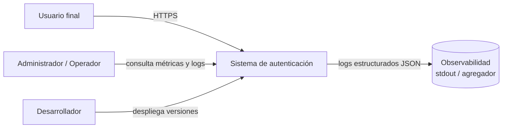
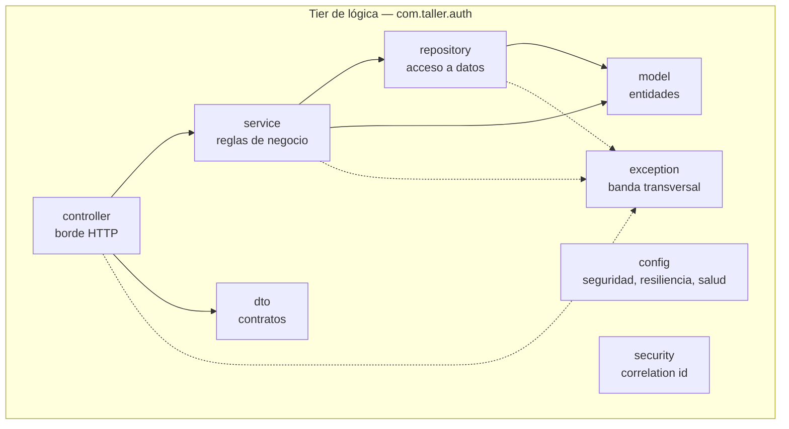
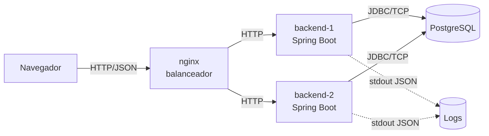
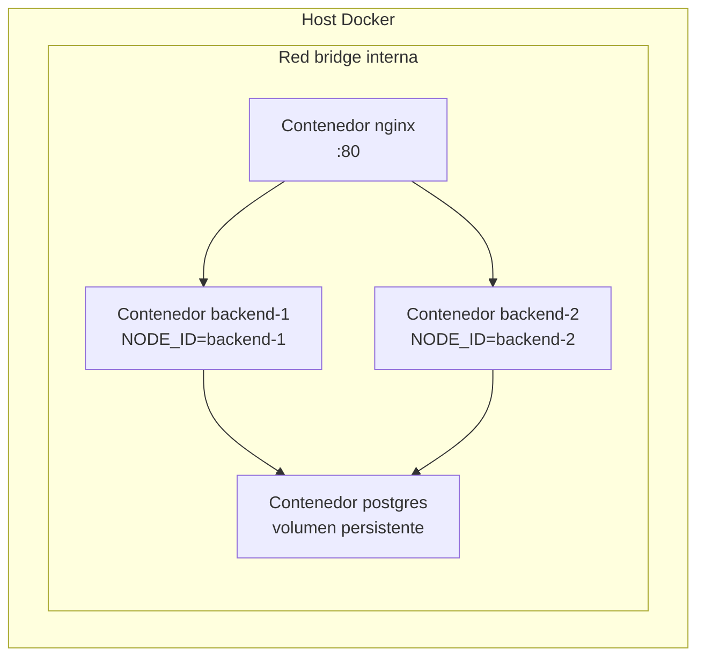
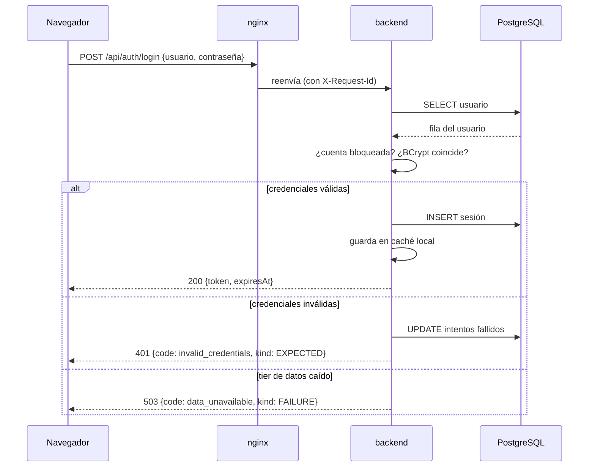
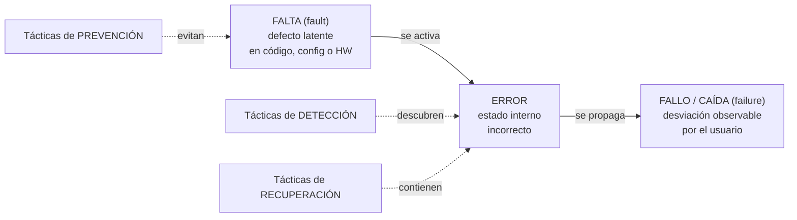
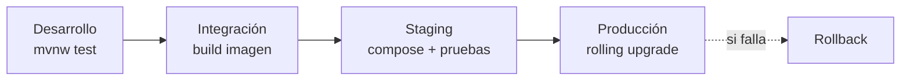

# Documento de Arquitectura de Software
## Sistema de autenticación de usuarios — Arquitectura 3-tier

**Curso:** Arquitectura de Software
**Marco de referencia:** Bass, Clements & Kazman, *Software Architecture in Practice*, 4.ª ed. — Capítulos 1, 2, 3, 4 y 5
**Versión del documento:** 1.0
**Fecha:** agosto de 2026

---

## Tabla de contenido

1. [Introducción y alcance](#1-introducción-y-alcance)
2. [Contexto del sistema](#2-contexto-del-sistema)
3. [Drivers arquitectónicos](#3-drivers-arquitectónicos)
4. [Atributos de calidad y escenarios](#4-atributos-de-calidad-y-escenarios)
5. [Vistas arquitectónicas](#5-vistas-arquitectónicas)
6. [Decisiones de arquitectura (ADR)](#6-decisiones-de-arquitectura-adr)
7. [Taxonomía de fallas: falta, error y fallo](#7-taxonomía-de-fallas-falta-error-y-fallo)
8. [Tácticas de disponibilidad aplicadas](#8-tácticas-de-disponibilidad-aplicadas-cap-4)
9. [Tácticas de desplegabilidad aplicadas](#9-tácticas-de-desplegabilidad-aplicadas-cap-5)
10. [Patrones arquitectónicos](#10-patrones-arquitectónicos)
11. [Análisis cuantitativo de disponibilidad](#11-análisis-cuantitativo-de-disponibilidad)
12. [Plan de medición y experimentos](#12-plan-de-medición-y-experimentos)
13. [Cuestionario basado en tácticas](#13-cuestionario-basado-en-tácticas)
14. [Deuda arquitectónica, riesgos y trabajo futuro](#14-deuda-arquitectónica-riesgos-y-trabajo-futuro)
15. [Trazabilidad](#15-trazabilidad)

---

## 1. Introducción y alcance

### 1.1 Propósito

Este documento describe la arquitectura de un sistema de autenticación de usuarios
construido como ejercicio del taller. No es un manual de uso: es el registro de las
**decisiones de diseño**, su justificación en términos de atributos de calidad, y la
evidencia medida de que esas decisiones producen el comportamiento esperado.

Sigue la definición del Capítulo 1: la arquitectura es *el conjunto de estructuras
necesarias para razonar sobre el sistema*, compuestas por elementos de software, las
relaciones entre ellos y las propiedades de ambos. Por eso el documento está organizado
alrededor de **estructuras** (sección 5) y **decisiones** (sección 6), no alrededor de
funcionalidades.

### 1.2 Alcance

**Dentro del alcance:** registro de usuarios, autenticación por usuario y contraseña,
gestión de sesiones con token, cierre de sesión, y las propiedades de disponibilidad y
desplegabilidad del sistema que provee esas funciones.

**Fuera del alcance:** recuperación de contraseña, autenticación de segundo factor,
federación de identidad (OAuth/SAML), autorización basada en roles. Se excluyen
deliberadamente: agregarían superficie funcional sin agregar nada al análisis de los
atributos de calidad que se están estudiando.

### 1.3 Premisa central

El Capítulo 3 establece que **la funcionalidad es independiente de la arquitectura**: casi
cualquier estructura puede implementar "autenticar un usuario". Lo que la arquitectura
determina es si ese login responde en 200 ms o en 8 s, si sobrevive a la caída de un
nodo, y si se puede actualizar sin sacar el sistema de servicio.

Por eso el sistema es deliberadamente pobre en funciones y rico en propiedades: la
funcionalidad es la excusa; el objeto de estudio son los atributos de calidad.

---

## 2. Contexto del sistema

### 2.1 Diagrama de contexto

### 2.2 Stakeholders

| Stakeholder | Interés principal | Atributo de calidad que le importa |
|---|---|---|
| Usuario final | Poder entrar cuando lo necesita | Disponibilidad, desempeño |
| Operador | Saber qué se rompió y dónde, rápido | Disponibilidad (MTTR), observabilidad |
| Desarrollador | Publicar cambios sin miedo y sin ventana nocturna | Desplegabilidad, modificabilidad |
| Docente / evaluador | Ver la teoría aplicada y medida | Trazabilidad de las decisiones |

La distinción importa porque, como señala el Capítulo 3, **un atributo de calidad mide la
utilidad del sistema para un stakeholder concreto**. "Disponibilidad" significa cosas
distintas para el usuario (poder hacer login) y para el operador (que el nodo caído se
reemplace solo).

---

## 3. Drivers arquitectónicos

### 3.1 Requisitos funcionales primarios

| ID | Requisito |
|---|---|
| RF-1 | Un visitante puede crear una cuenta con usuario y contraseña |
| RF-2 | Un usuario registrado puede autenticarse y obtener una sesión |
| RF-3 | El sistema valida una sesión existente en cada operación protegida |
| RF-4 | Un usuario puede cerrar su sesión |
| RF-5 | El sistema bloquea temporalmente una cuenta tras N intentos fallidos |

### 3.2 Restricciones

| ID | Restricción | Origen |
|---|---|---|
| RE-1 | Arquitectura de **3 tiers** con separación física de procesos | Enunciado del taller |
| RE-2 | Comunicación entre tiers por **canal remoto** (HTTP/REST y JDBC) | Enunciado del taller |
| RE-3 | Objetivo de disponibilidad de **99.99 %** | Enunciado del taller |
| RE-4 | Stack Java 21 / Spring Boot 3.3 / PostgreSQL 16 | Decisión de equipo |
| RE-5 | Despliegue local con Docker Compose (sin orquestador de producción) | Recursos del taller |
| RE-6 | Equipo de 3 personas, sesión de trabajo acotada | Contexto del curso |

RE-5 y RE-6 no son cosméticas: son las que explican por qué el sistema **no alcanza**
99.99 % real (sección 11) y por qué esa brecha es un hallazgo del trabajo, no un defecto
oculto.

### 3.3 Atributos de calidad priorizados

| Prioridad | Atributo | Justificación |
|---|---|---|
| 1 | **Disponibilidad** | Objeto del Cap. 4 y objetivo explícito del enunciado |
| 2 | **Desplegabilidad** | Objeto del Cap. 5; además condiciona la disponibilidad, porque los despliegues son una causa mayor de caídas |
| 3 | Modificabilidad | Habilita las dos anteriores: sin separación de responsabilidades no hay despliegue granular |
| 4 | Seguridad | Requisito del dominio (contraseñas), tratado como higiene, no como objeto de estudio |
| 5 | Desempeño | Se mide (p95) pero no se optimiza |

---

## 4. Atributos de calidad y escenarios

Los escenarios usan el formato de **seis partes** del Capítulo 3. Un escenario sin *medida
de respuesta* no es un escenario: es un deseo.

### 4.1 Escenarios de disponibilidad

#### ESC-D1 — Caída de una réplica del tier de lógica

| Parte | Valor |
|---|---|
| **Fuente del estímulo** | Interno al sistema: el proceso del backend |
| **Estímulo** | Falla por caída (*crash*) de una de las dos réplicas |
| **Artefacto** | Nodo `backend-1` del tier de lógica |
| **Entorno** | Operación normal, bajo carga de peticiones |
| **Respuesta** | El balanceador detecta el nodo caído y deja de enrutarle tráfico; las peticiones se atienden en la réplica superviviente; se registra el evento |
| **Medida de respuesta** | **0 peticiones fallidas** observadas por el cliente; detección en ≤ 3 s; sin intervención humana |

#### ESC-D2 — Caída del tier de datos

| Parte | Valor |
|---|---|
| **Fuente** | Externo al software: proceso de PostgreSQL |
| **Estímulo** | El tier de datos deja de responder |
| **Artefacto** | Conexión lógica→datos y funciones que dependen de persistencia |
| **Entorno** | Operación normal |
| **Respuesta** | El circuit breaker se abre tras N fallos; `login` y `register` responden `503` con código `data_unavailable` y mensaje comprensible; **`validate` de sesiones ya emitidas sigue respondiendo** desde caché local marcando `degraded: true`; ningún nodo sano se reinicia |
| **Medida** | Servicio **parcialmente disponible**: 100 % de éxito en `validate` de sesiones previas; degradación anunciada en ≤ 5 s; recuperación automática ≤ 10 s tras el retorno de la BD |

#### ESC-D3 — Latencia anómala en el tier de datos

| Parte | Valor |
|---|---|
| **Fuente** | Interno: el tier de datos |
| **Estímulo** | Una consulta tarda más de lo especificado (falta de desempeño que se convierte en falla) |
| **Artefacto** | Pool de conexiones del tier de lógica |
| **Entorno** | Operación normal |
| **Respuesta** | El timeout corta la espera y la convierte en un fallo explícito y acotado; el retry absorbe el caso transitorio; si persiste, abre el circuito |
| **Medida** | Peor caso acotado: `connection-timeout` de Hikari (1 s) × 2 intentos de Retry + espera entre intentos ≈ **2.1 s teóricos**; verificado empíricamente en ~2.3 s para la primera petición tras la caída (las siguientes bajan a milisegundos en cuanto el circuito abre). Siempre por debajo del `proxy_read_timeout` de nginx (8 s), para que el cliente reciba el 503/degraded del backend y no un 504 de nginx |

#### ESC-D4 — Excepción no prevista en el código

| Parte | Valor |
|---|---|
| **Fuente** | Interno: una falta latente en el código se activa |
| **Estímulo** | Se lanza una excepción no contemplada |
| **Artefacto** | Cualquier controlador o servicio |
| **Entorno** | Operación normal |
| **Respuesta** | El manejador transversal la captura, la clasifica como `FAULT`, la registra con `requestId` e incrementa el contador; el cliente recibe una respuesta homogénea sin traza técnica; el proceso **no** termina |
| **Medida** | **0 stack traces** expuestos; 100 % de las excepciones registradas con correlación; disponibilidad del proceso no afectada |

#### ESC-D5 — Ataque de fuerza bruta sobre una cuenta

| Parte | Valor |
|---|---|
| **Fuente** | Externa: actor malicioso |
| **Estímulo** | Intentos repetidos de autenticación con credenciales incorrectas |
| **Artefacto** | Servicio de autenticación y tier de datos |
| **Entorno** | Operación normal |
| **Respuesta** | Tras 5 intentos la cuenta se bloquea 60 s; el sistema sigue atendiendo al resto de usuarios con normalidad |
| **Medida** | Degradación del servicio para el resto de usuarios: **0 %**; el evento se clasifica como `EXPECTED`, no computa contra la disponibilidad |

#### ESC-D6 — Recuperación tras el retorno de un nodo

| Parte | Valor |
|---|---|
| **Fuente** | Operador |
| **Estímulo** | Se reinicia el nodo previamente caído |
| **Artefacto** | Nodo del tier de lógica |
| **Entorno** | Recuperación tras falla |
| **Respuesta** | El nodo arranca, pasa `liveness`, comprueba dependencias en `readiness` y solo entonces el balanceador vuelve a enviarle tráfico |
| **Medida** | **MTTR ≤ 30 s**; 0 peticiones enrutadas a un nodo que aún no está listo |

### 4.2 Escenarios de desplegabilidad

#### ESC-P1 — Despliegue de una nueva versión sin interrupción

| Parte | Valor |
|---|---|
| **Fuente** | Desarrollador |
| **Estímulo** | Solicita desplegar una nueva versión del tier de lógica |
| **Artefacto** | Las dos réplicas del backend |
| **Entorno** | Producción, con tráfico activo |
| **Respuesta** | *Rolling upgrade*: se actualiza una réplica, se espera su `readiness` en verde, y solo entonces se actualiza la segunda; apagado ordenado en cada una |
| **Medida** | **0 peticiones fallidas** durante el despliegue; *cycle time* ≤ 3 min; despliegue ejecutado con **un solo comando** |

#### ESC-P2 — Reversión de una versión defectuosa

| Parte | Valor |
|---|---|
| **Fuente** | Desarrollador u operador |
| **Estímulo** | La versión recién desplegada presenta un defecto en producción |
| **Artefacto** | Tier de lógica |
| **Entorno** | Producción |
| **Respuesta** | *Rollback* a la imagen etiquetada anterior mediante script |
| **Medida** | Reversión completa en **≤ 2 min**; sin pérdida de sesiones activas; sin migración inversa de base de datos |

#### ESC-P3 — Activación de una función sin desplegar

| Parte | Valor |
|---|---|
| **Fuente** | Product owner |
| **Estímulo** | Se decide activar o desactivar una función ya desplegada |
| **Artefacto** | Configuración del tier de lógica |
| **Entorno** | Producción |
| **Respuesta** | Se cambia el *feature toggle* por variable de entorno y se reinicia el nodo de forma escalonada |
| **Medida** | Cambio efectivo en ≤ 1 min; **0 recompilaciones**; el artefacto binario no cambia |

---

## 5. Vistas arquitectónicas

El Capítulo 1 clasifica las estructuras en tres tipos. Se documenta una vista de cada
tipo, porque cada una responde preguntas que las otras no pueden responder.

### 5.1 Vista de módulos — descomposición

Responde: *¿cómo está organizado el código y quién puede cambiar qué?*

**Relación de uso (dirección de las dependencias):** `controller → service → repository`.
Nunca al revés. El servicio no conoce HTTP; el repositorio no conoce reglas de negocio.
Esta es la aplicación directa de la regla estructural del Capítulo 1: *módulos con
ocultamiento de información e interfaces separadas de las implementaciones*.

Las flechas punteadas hacia `exception` no son dependencias de uso normales: representan
la **preocupación transversal**. Todo módulo lanza excepciones de esa jerarquía y un solo
punto las traduce a respuestas.

`config` y `security` **no aparecen como dependientes de nadie** a propósito: son
infraestructura transversal que Spring *inyecta* en los demás módulos (el filtro de
correlation id envuelve cada petición HTTP antes de que llegue al controlador; los beans
de `config` los usa el framework, no el código de negocio). Ninguna clase de `service` o
`controller` importa una clase de `config`/`security`, así que dibujar una flecha de
dependencia de código ahí sería inexacto.

### 5.2 Vista C&C — componentes y conectores en tiempo de ejecución

Responde: *¿qué se está ejecutando y cómo se habla entre sí?*

**Las dos fronteras remotas** (las líneas punteadas verticales del diagrama original del
taller) son: `navegador ↔ nginx ↔ backend` (HTTP) y `backend ↔ PostgreSQL` (JDBC). Ambas
pueden dar timeout, conexión rechazada o nodo caído; ambas necesitan tácticas. Que la
segunda no sea HTTP no la hace menos remota — de hecho es donde vive el pool de
conexiones, el recurso que se agota primero cuando el tier de datos se degrada.

### 5.3 Vista de asignación — despliegue

Responde: *¿dónde vive cada cosa y qué se cae junto?*

**Unidades de falla:** cada contenedor es una unidad de falla independiente. `backend-1` y
`backend-2` son **redundantes**; `nginx` y `postgres` son **puntos únicos de falla**. Esta
vista es la que hace visible ese hecho, y por eso es la que sustenta el análisis
cuantitativo de la sección 11. En una vista de módulos ese problema sería invisible.

### 5.4 Vista de comportamiento — secuencia de autenticación

Las tres ramas del `alt` son exactamente las tres clases de resultado que hay que
distinguir para medir: éxito, resultado esperado adverso y **fallo real**. Solo la tercera
cuenta contra la disponibilidad.

---

## 6. Decisiones de arquitectura (ADR)

### ADR-01 — Separación en tres tiers de despliegue

**Estado:** aceptada
**Contexto:** el enunciado exige 3 tiers con canal remoto.
**Decisión:** presentación (cliente web), lógica (Spring Boot) y datos (PostgreSQL +
capa repositorio) se despliegan como procesos y contenedores independientes.
**Consecuencias positivas:** cada tier escala y se despliega por separado; una caída del
tier de datos no arrastra al de lógica; se puede hacer rolling upgrade de un tier sin
tocar los otros.
**Consecuencias negativas:** latencia de red en cada salto; hay que manejar fallas
parciales que en un monolito no existirían; más piezas que operar.

### ADR-02 — El tier de datos es PostgreSQL, no un servicio HTTP propio

**Estado:** aceptada
**Contexto:** el diagrama del taller muestra tres cajas de aplicación. Una lectura
estricta pediría un tercer Spring Boot que exponga `/data/users`.
**Decisión:** el tier de datos es el motor de base de datos más la capa `repository` que
lo encapsula. La frontera remota es JDBC.
**Justificación:** un tercer servicio HTTP agregaría un despliegue, otro circuit breaker,
otra fuente de latencia y ~30 % más de código, sin cambiar ninguna conclusión del análisis
de disponibilidad. El presupuesto de tiempo del taller (RE-6) no lo permite.
**Mitigación:** gracias al patrón Repositorio, sustituir PostgreSQL por un servicio HTTP
**no requeriría cambiar ninguna clase de la capa de negocio**. La decisión es reversible;
esa reversibilidad es, en sí misma, el argumento de ocultamiento de información del Cap. 1.

### ADR-03 — `liveness` no consulta la base de datos

**Estado:** aceptada
**Contexto:** es tentador que el health check verifique todas las dependencias.
**Decisión:** `liveness` comprueba únicamente el estado interno del proceso.
`readiness` es el único que consulta PostgreSQL.
**Justificación:** si `liveness` dependiera de la BD, la caída del tier de datos haría que
el orquestador **reiniciara en cascada los nodos sanos** del tier de lógica, convirtiendo
una falla parcial en una caída total. Es el error clásico y es, precisamente, un caso de
táctica mal aplicada que empeora el atributo que pretendía mejorar.
**Consecuencias:** un nodo puede estar "vivo pero no listo". El balanceador lo saca de
rotación sin matarlo (*Removal from Service*), y vuelve solo cuando la dependencia sana.

### ADR-04 — Degradación con caché local de sesiones

**Estado:** aceptada
**Contexto:** al caer el tier de datos, la reacción por defecto sería devolver 503 a todo.
**Decisión:** el tier de lógica mantiene una caché en memoria de las sesiones que él mismo
emitió. Si el tier de datos cae, `validate` responde desde la caché con `degraded: true`.
**Justificación:** es preferible servicio parcial a caída total. Los usuarios ya
autenticados no notan nada; se pierde solo la capacidad de **crear** sesiones nuevas.
**Consecuencias negativas:** la caché es local a cada réplica y no es fuente de verdad; un
`logout` durante la degradación no se propaga a la otra réplica. Es una **inconsistencia
aceptada conscientemente**, acotada por el TTL de la sesión. Está detrás de un feature
toggle para poder demostrar el sistema con y sin la táctica.

### ADR-05 — Reintentos solo sobre operaciones idempotentes

**Estado:** aceptada
**Decisión:** el retry se aplica a lecturas y a actualizaciones idempotentes; nunca a la
creación de usuario o de sesión sin control.
**Justificación:** reintentar un `INSERT` a ciegas ante un timeout puede duplicar el
efecto cuando la operación **sí** se ejecutó y lo que se perdió fue la respuesta. El retry
mal aplicado convierte una falla de disponibilidad en una falla de integridad, que es peor.

### ADR-06 — Configuración externa y artefacto único

**Estado:** aceptada
**Decisión:** la misma imagen Docker se promueve por todos los entornos; toda diferencia
viene de variables de entorno y perfiles.
**Justificación:** es la condición de *repeatability* del Cap. 5. Si se recompila por
entorno, lo probado en staging no es lo que corre en producción y las pruebas pierden
valor probatorio.

### ADR-07 — `noRollbackFor` en operaciones que registran su propio fallo

**Estado:** aceptada (corrige un defecto real encontrado al escribir `AvailabilityIT`)
**Contexto:** `AuthService.login()` esta anotado `@Transactional` porque, en el camino
exitoso, toca dos tablas (`users` y `sessions`) y necesitan commitear juntas. Por defecto,
Spring revierte la transaccion completa ante **cualquier** `RuntimeException` no marcada
como checked — y `InvalidCredentialsException`/`AccountLockedException` lo son, porque
extienden `AppException extends RuntimeException`.

El efecto: cada intento fallido llamaba `lockoutPolicy.registerFailure(user, now)` y
`userRepository.save(user)` para persistir el contador, y **acto seguido** lanzaba
`InvalidCredentialsException`. Spring interpretaba esa excepcion como una razon para
deshacer la transaccion completa — incluyendo el `save` que acababa de registrar el
intento fallido. Resultado: la cuenta nunca se bloqueaba de verdad, sin importar cuantas
veces se probara la password mala. La API respondia `401` en cada intento (correcto), pero
el efecto secundario que debia acumularse (el contador) desaparecia con cada rollback.

**Como se detecto:** ningun test manual (Fase 4) probo un **sexto** intento tras agotar el
umbral; `AvailabilityIT.unaCuentaBloqueadaPorFuerzaBrutaNoAfectaAOtrosUsuarios` si lo hizo,
y fallo con `expected: 423 LOCKED but was: 200 OK`. Es la prueba mas concreta, dentro de
este proyecto, de por que **ESC-D5 sin una medida automatizada es solo una aspiracion**.

**Decisión:** `@Transactional(noRollbackFor = AppException.class)` en `AuthService.login()`.
Cuando el metodo lanza una `AppException` (un resultado `EXPECTED`), la transaccion
**comitea** igual: el efecto secundario que la motivo (contar el intento, en este caso) es
precisamente lo que se quiere conservar.
**Justificación:** una `AppException` no es un error del sistema que deba deshacer trabajo;
es información de negocio. Tratar "password incorrecta" como si fuera un fallo que invalida
toda la transacción es exactamente el tipo de confusión entre `EXPECTED` y `FAILURE` que la
sección 7 advierte, aplicada esta vez no a una metrica sino al propio flujo de control.
**Consecuencias:** cualquier metodo `@Transactional` que registre estado (contadores,
auditoria, intentos) antes de lanzar una excepcion de negocio debe revisarse con el mismo
criterio. Estar anotado `@Transactional` no garantiza que un efecto secundario sobreviva si
el metodo termina en excepcion — hay que decidirlo explícitamente por excepcion.

---

## 7. Taxonomía de fallas: falta, error y fallo

El Capítulo 4 distingue tres términos que en el lenguaje corriente se usan como sinónimos.
La distinción no es académica: determina **qué se cuenta** al calcular la disponibilidad.

Toda táctica del Capítulo 4 corta esta cadena en algún punto. Prevenir actúa antes de que
la falta exista o se active; detectar descubre el error antes de que se vuelva fallo;
recuperar contiene el error para que no llegue al usuario.

### 7.1 Clasificación en el código

Se implementa el enum `FaultKind`, y cada excepción de la jerarquía `AppException` declara
la suya:

| `FaultKind` | Significado | ¿Cuenta contra la disponibilidad? |
|---|---|---|
| `EXPECTED` | Resultado de negocio previsto | **No.** El sistema funciona correctamente |
| `FAULT` | Falta latente que acaba de activarse (excepción no prevista) | **Sí** |
| `ERROR` | Estado interno incorrecto, contenido dentro del tier | Parcialmente: se registra pero no siempre es visible |
| `FAILURE` | Desviación observable del servicio | **Sí** |

### 7.2 Catálogo de errores

| Código | HTTP | `kind` | Reintentable | Significado |
|---|---|---|---|---|
| `invalid_credentials` | 401 | EXPECTED | no | Usuario o contraseña incorrectos |
| `account_locked` | 423 | EXPECTED | no | Bloqueo temporal por intentos fallidos |
| `user_already_exists` | 409 | EXPECTED | no | El usuario ya está registrado |
| `validation_error` | 400 | EXPECTED | no | Datos de entrada inválidos (Bean Validation) |
| `malformed_request` | 400 | EXPECTED | no | Cuerpo de la petición no es JSON válido |
| `invalid_session` | 401 | EXPECTED | no | Token inexistente o expirado |
| `data_unavailable` | 503 | FAILURE | sí | El tier de datos no responde (timeout, retry agotado o circuito abierto) |
| `internal_error` | 500 | FAULT | no | Excepción no prevista (falta latente activada) |

No existe un código `circuit_open` ni `downstream_timeout` separados: cuando el circuito
está abierto o una consulta excede el timeout, el `fallbackMethod` de Resilience4j
intercepta la excepción y la reduce siempre a `data_unavailable`/503. Es intencional —
al cliente le basta con saber "el tier de datos no responde, reintenta luego"; distinguir
la causa exacta solo importa para el operador, y esa causa sí queda diferenciada en el
log (`event=circuit_breaker_state_change` en `ResilienceConfig`) y en `/api/diagnostics`.

**Punto crítico para la medición:** una contraseña equivocada es `EXPECTED`. Si se contara
como fallo, un usuario torpe bajaría la disponibilidad reportada y la métrica del 99.99 %
no significaría nada. Este es el error más común en la instrumentación de estos sistemas.

---

## 8. Tácticas de disponibilidad aplicadas (Cap. 4)

### 8.1 Detectar fallas

| Táctica | Implementación | Escenario que atiende |
|---|---|---|
| **Ping/Echo** | `GET /actuator/health/liveness`, consultado por el `HEALTHCHECK` de Docker y por nginx | ESC-D1, ESC-D6 |
| **Sanity Checking / Self-Test** | `DataTierHealthIndicator`: `SELECT 1` con timeout corto | ESC-D2 |
| **Condition Monitoring** | `readiness` evalúa el estado de las dependencias antes de aceptar tráfico | ESC-D6 |
| **Monitor** | Actuator + Micrometer: contador `errors.<kind>` (`errors.expected`, `errors.fault`, `errors.error`, `errors.failure`, etiquetado por `code`) incrementado en `GlobalExceptionHandler`; estado del circuito expuesto en `/api/diagnostics` | Todos |
| **Heartbeat** | Tarea `@Scheduled` que emite un latido con el `NODE_ID` | ESC-D1 |
| **Exception Detection** | `GlobalExceptionHandler` con handler de `Exception.class` | ESC-D4 |
| **Timestamp** | `createdAt` / `expiresAt` en las sesiones, para detectar estado obsoleto | ESC-D2 |

**Diferencia que conviene tener clara en la sustentación:** *Ping/Echo* lo inicia el
monitor (pregunta y espera respuesta); *Heartbeat* lo inicia el componente monitoreado
(anuncia que sigue vivo). El primero detecta también fallas de red hacia el nodo; el
segundo no requiere que el monitor conozca a todos los nodos.

### 8.2 Recuperar de fallas — preparación y reparación

| Táctica | Implementación | Escenario |
|---|---|---|
| **Redundant Spare (active / hot spare)** | 2 réplicas activas del backend tras nginx, ambas atendiendo tráfico | ESC-D1 |
| **Retry** | Resilience4j con backoff exponencial y *jitter*, solo sobre operaciones idempotentes (ADR-05) | ESC-D3 |
| **Exception Handling** | La banda transversal: ninguna excepción termina el proceso | ESC-D4 |
| **Graceful Degradation** | Caché local de sesiones: `validate` sigue funcionando con el tier de datos caído (ADR-04) | ESC-D2 |
| **Rollback** | `scripts/rollback.sh`, vuelta a la imagen etiquetada anterior | ESC-P2 |

El *jitter* en el backoff no es un detalle: sin él, todos los clientes reintentan en el
mismo instante y producen una tormenta de reintentos que impide que el servicio caído se
levante. Es un caso de táctica que, mal implementada, prolonga el MTTR.

### 8.3 Recuperar de fallas — reintroducción

| Táctica | Implementación | Escenario |
|---|---|---|
| **State Resync** | Al recuperarse el tier de datos, la caché local deja de usarse y la fuente de verdad vuelve a ser la BD | ESC-D2 |
| **Escalating Restart** | Escalado manual documentado: reiniciar el contenedor → reiniciar el stack → restaurar volumen | ESC-D6 |

### 8.4 Prevenir fallas

| Táctica | Implementación | Escenario |
|---|---|---|
| **Removal from Service** | `readiness` en rojo saca el nodo de rotación en nginx sin matarlo (ADR-03) | ESC-D6 |
| **Transactions** | `@Transactional` en `AuthService.login()`, que toca `users` y `sessions` juntas; con `noRollbackFor` explícito para que un resultado `EXPECTED` no deshaga el registro del intento (ADR-07) | ESC-D5 |
| **Increase Competence Set** | Bloqueo por intentos fallidos y validación de entrada: el sistema trata estados adversos como previstos, no como excepciones. Su persistencia real depende de ADR-07 — sin `noRollbackFor`, el contador se revertía en cada intento y la cuenta nunca llegaba a bloquearse | ESC-D5 |
| **Exception Prevention** | Validación con Bean Validation en el borde; tipos fuertes; `Optional` en lugar de nulos | ESC-D4 |

---

## 9. Tácticas de desplegabilidad aplicadas (Cap. 5)

### 9.1 Las tres cualidades exigidas

El Capítulo 5 dice que un despliegue debe ser **granular, controlable y eficiente**:

| Cualidad | Cómo se logra aquí |
|---|---|
| **Granular** | Cada tier es una unidad desplegable independiente; se puede actualizar la lógica sin tocar los datos |
| **Controlable** | El rolling upgrade avanza réplica por réplica, condicionado a `readiness`; el rollback es un comando |
| **Eficiente** | Todo el despliegue es un script; el cycle time se mide, no se estima |

### 9.2 Tácticas

| Categoría | Táctica | Implementación |
|---|---|---|
| Gestionar el pipeline | **Script Deployment Commands** | `rolling-upgrade.sh`, `rollback.sh`: cero pasos manuales |
| Gestionar el pipeline | **Scale Rollouts** | El upgrade avanza de a una réplica, verificando salud entre pasos |
| Gestionar el pipeline | **Rollback** | Reversión por etiqueta de imagen |
| Gestionar el sistema desplegado | **Feature Toggle** | `features.session-cache`, `features.new-dashboard` por variable de entorno |
| Gestionar el sistema desplegado | **Package Dependencies** | Imagen Docker multietapa: dependencias congeladas en el artefacto |
| Gestionar el sistema desplegado | **Manage Service Interactions** | Apagado ordenado (`graceful shutdown`) para no cortar peticiones en vuelo |

### 9.3 Pipeline

**Cycle time** = tiempo desde el *commit* hasta que el cambio está sirviendo tráfico en
producción. Es la medida central del Capítulo 5 y se registra en `rolling-upgrade.sh`.

**Trazabilidad:** cada imagen se etiqueta con el hash del commit, de modo que para
cualquier contenedor en ejecución se puede decir exactamente qué código contiene.

---

## 10. Patrones arquitectónicos

| Patrón | Dónde | Qué aporta |
|---|---|---|
| **Three-tier / N-tier** | Estructura global | Separación de responsabilidades con fronteras de despliegue |
| **Layers** | Interior del tier de lógica | Dependencias en un solo sentido: controller → service → repository |
| **Repository** | `repository/` | Oculta la decisión de motor de persistencia (habilita ADR-02) |
| **Load-Balanced Cluster** | nginx + 2 réplicas | Redundancia activa, base de ESC-D1 |
| **Circuit Breaker** | Acceso al tier de datos | Evita el fallo en cascada y el agotamiento del pool |
| **Blue-Green / Rolling Upgrade** | `rolling-upgrade.sh` | Despliegue sin interrupción (ESC-P1) |
| **Health Endpoint Monitoring** | Actuator | Base de detección y de *Removal from Service* |

La relación entre patrones y tácticas es la del Capítulo 3: **un patrón agrupa varias
tácticas**. Por ejemplo, el patrón Load-Balanced Cluster combina Redundant Spare,
Ping/Echo y Removal from Service. Las tácticas son decisiones puntuales; los patrones son
paquetes probados de decisiones que se refuerzan entre sí.

---

## 11. Análisis cuantitativo de disponibilidad

### 11.1 Fórmulas

$$A = \frac{MTBF}{MTBF + MTTR}$$

- **MTBF** — tiempo medio entre fallas
- **MTTR** — tiempo medio de reparación
- Componentes **en serie** (todos necesarios): $A_{total} = \prod A_i$
- Componentes **en paralelo** (redundantes, basta uno): $A_{total} = 1 - \prod (1 - A_i)$

### 11.2 Estimación por componente

Valores estimados para el entorno del taller (un solo host Docker):

| Componente | MTBF | MTTR | Disponibilidad | Configuración |
|---|---|---|---|---|
| nginx | 2000 h | 1 h | 0.99950 | **Único (SPOF)** |
| backend (una réplica) | 200 h | 1 h | 0.99502 | — |
| backend (2 réplicas) | — | — | **0.99998** | Paralelo |
| PostgreSQL | 1000 h | 1 h | 0.99900 | **Único (SPOF)** |

Redundancia del backend:

$$A_{backend} = 1 - (1 - 0.99502)^2 = 1 - (0.00498)^2 = 0.9999752$$

Cadena en serie:

$$A_{sistema} = 0.99950 \times 0.9999752 \times 0.99900 = 0.99848$$

### 11.3 Resultado y brecha

| Métrica | Valor |
|---|---|
| Disponibilidad estimada | **99.85 %** |
| Tiempo de inactividad anual estimado | **≈ 13.3 horas** |
| Objetivo (RE-3) | 99.99 % |
| Presupuesto de caída del objetivo | 52.6 min/año — 4.32 min/mes |
| **Brecha** | El sistema está **un orden de magnitud por encima** del presupuesto permitido |

### 11.4 Interpretación — el hallazgo central del trabajo

**La redundancia del backend no es el cuello de botella.** Duplicar réplicas lleva ese
componente a 99.998 %, muy por encima del objetivo. El límite lo imponen los **dos puntos
únicos de falla**: nginx y PostgreSQL. En una cadena en serie, la disponibilidad total
nunca supera a la del eslabón más débil, así que agregar una tercera réplica del backend
**no mejoraría la cifra en absoluto**.

Este es el resultado más valioso del análisis: muestra que optimizar donde es fácil —
agregar réplicas de la aplicación — no mueve la aguja cuando el problema está en otra
parte. Sin el cálculo, la intuición habría llevado exactamente a esa optimización inútil.

Escenario con los SPOF eliminados (nginx redundante con IP virtual, PostgreSQL con réplica
en espera y failover automático, ambos a 99.99 %):

$$A = 0.9999 \times 0.9999752 \times 0.9999 = 0.99978 \Rightarrow \approx 1.9 \text{ h/año}$$

Aun así queda por debajo de 99.99 %. Alcanzar cuatro nueves reales exigiría además reducir
el MTTR de una hora a **minutos**, lo que requiere detección y conmutación automáticas en
todos los niveles, no solo redundancia. La conclusión honesta es que **99.99 % no es
alcanzable con la infraestructura permitida por RE-5**, y eso debe reportarse como
limitación conocida, no disimularse.

---

## 12. Plan de medición y experimentos

Hay dos niveles de verificación, y ninguno sustituye al otro. Los tests automatizados
(`./mvnw test`, 35 casos, corren en segundos sin Docker sobre H2) prueban que la **lógica**
hace lo que dice que hace. Los experimentos de caos de esta sección prueban que el
**sistema desplegado** (réplicas, balanceador, red) se comporta igual bajo condiciones
reales. Un login que pasa todos los tests unitarios puede seguir fallando en producción si
nginx no hace failover correctamente; un sistema que sobrevive al chaos-kill puede tener,
debajo, una regla de negocio rota que ningún experimento manual ejercita. Ambos hicieron
falta en este proyecto: la sección 13.1 documenta un defecto (ADR-07, contador de
bloqueo revertido por Spring) que **ningún experimento manual de la Fase 4 detectó** y que
sí detectó `AvailabilityIT` al probar explícitamente un sexto intento de login.

### 12.0 Suite de tests automatizados

| Clase | Tipo | Qué prueba |
|---|---|---|
| `LockoutPolicyTest` | Unitario | Lógica de bloqueo en aislamiento (sin Spring) |
| `TokenServiceTest` | Unitario | Emisión/validación/expiración de sesiones, con `SessionRepository` simulado |
| `AuthServiceTest` | Unitario | Reglas de registro/login, con `UserRepository`/`TokenService` simulados y BCrypt real |
| `AuthControllerIT` | Integración (Spring real + H2) | Contrato HTTP completo de `/api/auth` y `/api/diagnostics` |
| `AvailabilityIT` | Integración (Spring real + H2) | Taxonomía `FaultKind` end-to-end, correlation id, salud, y el escenario de fuerza bruta (ESC-D5) |

`AvailabilityIT` merece mención aparte porque es, en este proyecto, la regresión
automatizada de **dos** defectos reales que ya no pueden volver sin que la suite se ponga
roja:

1. **Resilience4j enrutaba cualquier excepción al `fallbackMethod`** (Fase 4): una password
   incorrecta llegaba a responder `503 data_unavailable` en vez de `401 invalid_credentials`.
   Los tests `unaPasswordIncorrectaEsExpected...`, `unTokenInexistenteEsExpected...` y
   `unRegistroDuplicadoEsExpected...` verifican el `kind` exacto del cuerpo de error, no solo
   el código HTTP — así una regresión futura no puede colarse devolviendo el status correcto
   por casualidad con el `kind` equivocado.
2. **El contador de intentos fallidos se revertía por el rollback transaccional por
   defecto de Spring** (ADR-07, encontrado en esta misma fase): el test
   `unaCuentaBloqueadaPorFuerzaBrutaNoAfectaAOtrosUsuarios` agota los 5 intentos y verifica
   que el sexto — con la password correcta — siga bloqueado. Sin `noRollbackFor`, este test
   falla con `expected: 423 LOCKED but was: 200 OK`.

Nota de infraestructura de pruebas: Surefire por defecto solo reconoce `*Test.java`, no
`*IT.java` (esa es la convención del plugin Failsafe, que corre en la fase `verify`). Para
que un solo `./mvnw test` cubra ambos niveles sin pasos adicionales, `pom.xml` extiende los
`includes` de Surefire con `**/*IT.java`.

### 12.1 Instrumento

`scripts/probe.sh` envía una petición cada 0.5 s a través de nginx, clasifica cada muestra
como éxito o fallo según la taxonomía de la sección 7 (los `EXPECTED` **no** cuentan como
fallo), y al terminar calcula: disponibilidad observada, número de ventanas de caída,
MTBF, MTTR y latencias p50/p95/p99. Emite además un CSV crudo para graficar.

### 12.2 Experimentos

| # | Experimento | Acción | Resultado esperado | Escenario |
|---|---|---|---|---|
| E1 | Línea base | Sonda 5 min sin perturbación | 100 %; p95 < 300 ms | — |
| E2 | Muerte de una réplica | `docker compose stop backend-1` | **0 muestras fallidas** | ESC-D1 |
| E3 | Retorno de la réplica | `docker compose start backend-1` | Vuelve a rotación tras `readiness`; MTTR ≤ 30 s | ESC-D6 |
| E4 | Caída del tier de datos | `docker compose stop postgres` | `login` → 503; `validate` → `degraded: true`; nodos sanos **no** se reinician | ESC-D2 |
| E5 | Rolling upgrade | `scripts/rolling-upgrade.sh` | 0 muestras fallidas; cycle time registrado | ESC-P1 |
| E6 | Rollback | `scripts/rollback.sh` | Reversión ≤ 2 min; sesiones intactas | ESC-P2 |
| E7 | Fuerza bruta | 10 intentos fallidos seguidos | Bloqueo al 5.º; disponibilidad para otros usuarios sin cambio | ESC-D5 |

### 12.3 Plantilla de resultados

| # | Disponibilidad observada | Muestras | Fallidas | Ventanas de caída | MTTR | p95 | ¿Cumple? |
|---|---|---|---|---|---|---|---|
| E1 | | | | | | | |
| E2 | | | | | | | |
| E3 | | | | | | | |
| E4 | | | | | | | |
| E5 | | | | | | | |
| E6 | | | | | | | |
| E7 | | | | | | | |

**Advertencia metodológica:** la disponibilidad medida en una ventana de minutos **no es**
la disponibilidad anual. Una ventana corta con una caída de 20 s da cifras catastróficas;
una sin incidentes da 100 %. Lo que estas mediciones prueban es el **comportamiento
cualitativo** de las tácticas (¿se detectó?, ¿se recuperó?, ¿en cuánto?), y de ahí se
alimenta el MTTR del modelo de la sección 11. La cifra anual sale del modelo, no de la
sonda.

---

## 13. Cuestionario basado en tácticas

Formato del Capítulo 3: para cada táctica, si está soportada, el riesgo de su ausencia o
implementación parcial, la decisión de diseño y su ubicación.

### 13.1 Disponibilidad

| Táctica | ¿Soportada? | Riesgo | Decisión y ubicación | Justificación |
|---|---|---|---|---|
| Ping/Echo | Sí | L | Actuator liveness + healthcheck Docker | Detección en ≤ 3 s |
| Monitor | Sí | L | Micrometer + `/actuator/metrics` | Base de toda medición |
| Heartbeat | Sí | L | `@Scheduled` con `NODE_ID` | Complementa Ping/Echo |
| Timestamp | Sí | L | `expiresAt` en sesiones | Detecta estado obsoleto |
| Condition Monitoring | Sí | L | `DataTierHealthIndicator` | Alimenta readiness |
| Sanity Checking | Sí | L | `SELECT 1` con timeout | Self-test del tier |
| Voting | **No** | L | — | Requiere réplicas que calculen lo mismo; no aplica a este dominio |
| Exception Detection | Sí | L | `GlobalExceptionHandler` | Ninguna excepción pasa inadvertida |
| Self-Test | Sí | L | `SELECT 1` en cada consulta a `readiness`, no solo al iniciar | `DataTierHealthIndicator` |
| Redundant Spare | Sí | L | 2 réplicas activas tras nginx | Base de ESC-D1 |
| Rollback | Sí | L | `rollback.sh` | Reversión ≤ 2 min |
| Exception Handling | Sí | L | Banda transversal | 0 stack traces expuestos |
| Retry | Sí | M | Resilience4j, solo idempotentes | Riesgo si se extendiera a escrituras |
| Ignore Faulty Behavior | **No** | L | — | No hay fuentes externas no confiables |
| Graceful Degradation | Sí | M | Caché local de sesiones | Inconsistencia acotada aceptada (ADR-04) |
| Reconfiguration | **No** | M | — | Sin orquestador; la reconfiguración es manual |
| Shadow | **No** | L | — | Fuera del alcance |
| State Resync | Parcial | M | La caché cede ante la BD al recuperarse | Sin reconciliación de logouts perdidos |
| Escalating Restart | Parcial | M | Documentado, no automatizado | Depende del operador |
| Nonstop Forwarding | **No** | L | — | Propio de elementos de red |
| Removal from Service | Sí | L | readiness + `max_fails` en nginx | ADR-03 |
| Transactions | Sí | L | `@Transactional(noRollbackFor = AppException.class)` en `login()` (ADR-07) | Integridad ante fallas parciales, sin deshacer el registro de un resultado EXPECTED |
| Predictive Model | **No** | **H** | — | **Sin predicción de degradación: las fallas solo se detectan cuando ya ocurrieron** |
| Exception Prevention | Sí | L | Bean Validation, tipos fuertes | Reduce faltas latentes |
| Increase Competence Set | Sí | L | Bloqueo por intentos (`LockoutPolicy` + ADR-07) | Estados adversos previstos. Corregido un defecto real (rollback silencioso del contador) detectado por `AvailabilityIT`, no por inspección manual |

### 13.2 Desplegabilidad

| Táctica | ¿Soportada? | Riesgo | Decisión y ubicación |
|---|---|---|---|
| Scale Rollouts | Sí | L | Rolling upgrade réplica por réplica |
| Rollback | Sí | L | `rollback.sh` por etiqueta |
| Script Deployment Commands | Sí | L | Todo el despliegue está guionado |
| Manage Service Interactions | Parcial | M | Graceful shutdown; sin versionado de API |
| Package Dependencies | Sí | L | Imagen multietapa |
| Feature Toggle | Sí | L | Variables de entorno |
| Canary Testing | **No** | M | Requiere enrutamiento por porcentaje |
| A/B Testing | **No** | L | Fuera del alcance |
| Blue-Green | Parcial | L | Se optó por rolling; blue-green necesitaría duplicar el stack |

### 13.3 Riesgos altos detectados

**R-1 (Alto) — Ausencia de Predictive Model.** El sistema solo reacciona a fallas
consumadas. No hay detección de tendencias (crecimiento del pool de conexiones, latencia
en aumento, memoria). En términos del Capítulo 4, todo el esfuerzo está en *detectar* y
*recuperar*, y muy poco en *prevenir*. Con MTTR de una hora, prevenir vale más que
recuperar.

---

## 14. Deuda arquitectónica, riesgos y trabajo futuro

### 14.1 Deuda asumida conscientemente

El Capítulo 3 define la deuda arquitectónica como el deterioro gradual del diseño. La
deuda deliberada y registrada es gestionable; la no documentada es la peligrosa. Se
registra:

| # | Deuda | Motivo | Costo de saldarla |
|---|---|---|---|
| DA-1 | nginx es SPOF | RE-5: un solo host | Alto: requiere IP virtual y segundo balanceador |
| DA-2 | PostgreSQL es SPOF | RE-5, RE-6 | Alto: réplica en espera y failover automático |
| DA-3 | Caché de sesiones local por réplica | ADR-04 | Medio: caché distribuida (Redis) — que a su vez sería otro SPOF |
| DA-4 | Sin versionado de la API | Alcance del taller | Bajo si se hace ahora, alto después |
| DA-5 | Escalating Restart manual | Sin orquestador | Medio: migrar a Kubernetes |
| DA-6 | Tier de datos no es servicio propio | ADR-02 | Medio, y acotado por el patrón Repositorio |

### 14.2 Trabajo futuro, priorizado por impacto en el objetivo

1. **Eliminar los SPOF** (DA-1, DA-2). Es lo único que mueve la cifra de la sección 11.
2. **Reducir el MTTR** con conmutación automática. Segundo en impacto y probablemente más
   barato que lo anterior.
3. **Predictive Model** (R-1): alertas sobre tendencias, no solo sobre caídas.
4. Canary testing, que requiere enrutamiento por porcentaje en el balanceador.
5. Versionado de la API antes de que existan clientes que no se puedan actualizar.

---

## 15. Trazabilidad

| Escenario | Táctica principal | Decisión | Ubicación en el código | Experimento |
|---|---|---|---|---|
| ESC-D1 | Redundant Spare | ADR-01 | `docker-compose.yml`, `nginx.conf` | E2 |
| ESC-D2 | Graceful Degradation | ADR-04 | `TokenService` (`validateFallback`, caché local) | E4 |
| ESC-D3 | Retry + Circuit Breaker | ADR-05 | `TokenService`/`AuthService` (`@Retry`/`@CircuitBreaker`), `ResilienceConfig` (log de transiciones), `application.yml` | E4 |
| ESC-D4 | Exception Detection | — | `GlobalExceptionHandler` | E1 |
| ESC-D5 | Increase Competence Set | ADR-07 | `LockoutPolicy`, `AuthService` (`noRollbackFor`) | E7, `AvailabilityIT` |
| ESC-D6 | Removal from Service | ADR-03 | `DataTierHealthIndicator`, `nginx.conf` | E3 |
| ESC-P1 | Scale Rollouts | ADR-06 | `scripts/rolling-upgrade.sh` | E5 |
| ESC-P2 | Rollback | ADR-06 | `scripts/rollback.sh` | E6 |
| ESC-P3 | Feature Toggle | ADR-06 | `application.yml`, `TokenService`, `DiagnosticsController` | — |

---

## Anexo A — Glosario

| Término | Definición |
|---|---|
| **Falta (fault)** | Defecto latente en código, configuración o hardware |
| **Error** | Estado interno incorrecto resultante de activar una falta |
| **Fallo / caída (failure)** | Desviación observable del servicio respecto de su especificación |
| **MTBF** | Tiempo medio entre fallas |
| **MTTR** | Tiempo medio de reparación |
| **SPOF** | Punto único de falla: componente sin redundancia cuya caída detiene el sistema |
| **Cycle time** | Tiempo desde el commit hasta que el cambio sirve tráfico en producción |
| **Táctica** | Decisión de diseño puntual que afecta la respuesta ante un estímulo de un atributo de calidad |
| **Patrón** | Solución recurrente y probada que agrupa varias tácticas |
| **Escenario de atributo de calidad** | Especificación de seis partes: fuente, estímulo, artefacto, entorno, respuesta y medida |

## Anexo B — Referencias

- Bass, L., Clements, P., & Kazman, R. *Software Architecture in Practice*, 4.ª ed.
  Addison-Wesley. Capítulos 1–5.
- Documentación de Spring Boot Actuator y Resilience4j.
